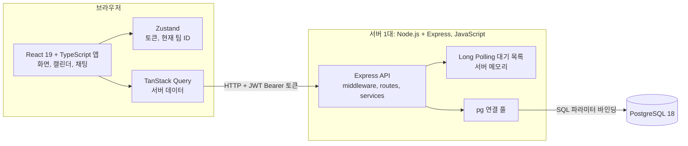
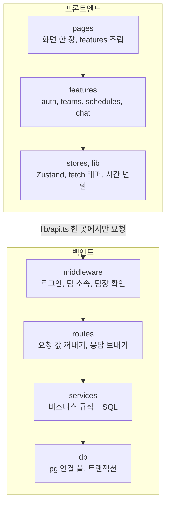
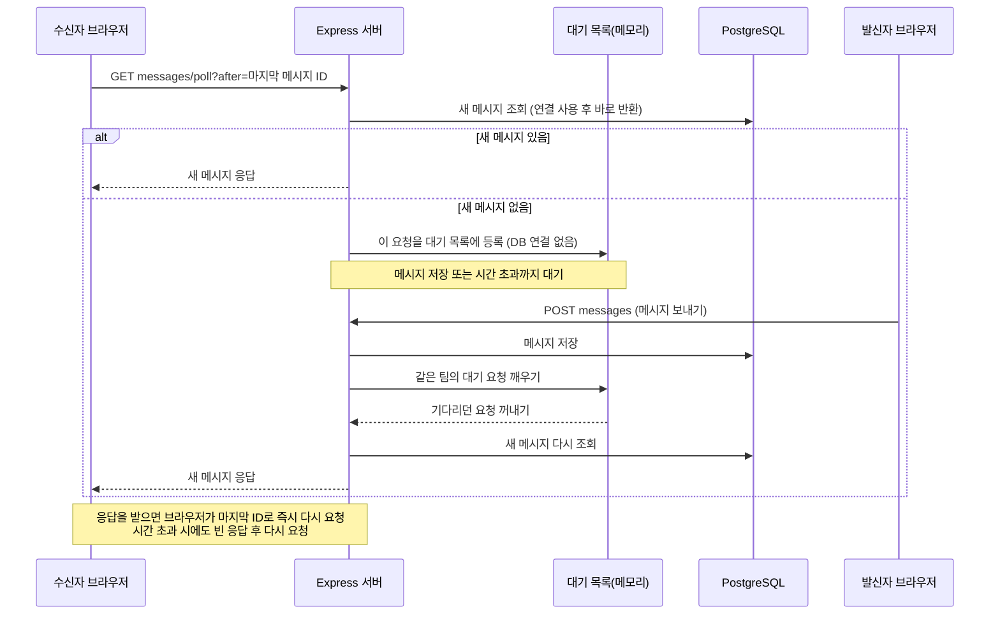
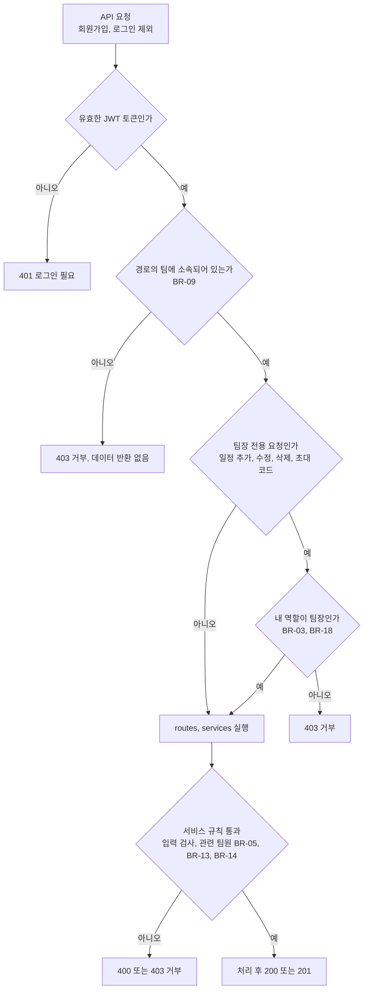
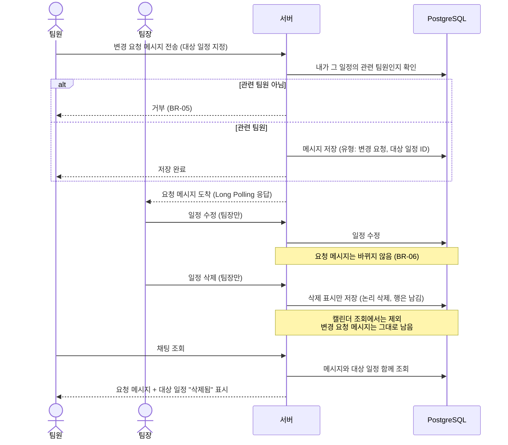

# Team CalTalk 기술 아키텍처 다이어그램

버전 0.2 · 최종 수정일 2026-09-30

참조 문서: `docs/1-domain-definition.md` (도메인 정의서 v0.4), `docs/2-PRD.md` (PRD v0.8), `docs/3-user-scenario.md` (사용자 시나리오 v0.2), `docs/4-wireframes.md` (와이어프레임 v0.5), `docs/5-project-principle.md` (프로젝트 구조 설계 원칙 v0.2)

## 0. 이 문서를 읽는 법

- 구조를 한눈에 보기 위한 그림 모음이다. 문서에 없는 것은 그리지 않았다.
- 그림은 5장이다. 1장이 전체 구조이고, 2~5장은 따로 설명이 필요한 부분만 뺐다. 회원가입·로그인, 팀 생성·참여, 일정 조회처럼 단순한 흐름은 그림을 만들지 않았다.
- 서버는 1대(프로세스 1개)를 전제로 한다(설계 원칙 S5-16). 로드밸런서, 캐시, 메시지 브로커, CDN, 별도 실시간 서버는 없다(P1-3).
- 근거 ID는 도메인 정의서(BR, UC), PRD(FR, NFR, R), 프로젝트 구조 설계 원칙(P, B, F, S, A)의 번호다.

## 1. 전체 구조

브라우저의 React 앱이 HTTP 요청만으로 Express 서버와 통신하고, 서버는 `pg`로 PostgreSQL에 SQL을 직접 실행한다. 새 메시지도 별도 연결 없이 일반 HTTP 요청(Long Polling)으로 받는다.
근거: PRD 8장, P1-3, NFR-08, S5-9, S5-16

## 2. 코드 레이어

의존 방향은 한쪽이다. 위 레이어가 아래 레이어를 부르고, 아래는 위를 모른다. 백엔드는 권한 검사를 `middleware` 한곳에서 하고, 프론트엔드는 서버 데이터는 TanStack Query, 브라우저 상태는 Zustand로 나눈다.
근거: 설계 원칙 2장(B2-1~B2-5, F2-1~F2-5), NFR-03

## 3. Long Polling 메시지 수신 흐름

새 메시지가 없으면 서버는 DB 연결을 잡지 않고 메모리에서 기다린다. 메시지가 저장되면 기다리던 요청을 깨워 다시 조회하고, 시간이 다 되면(상한 약 25초, 제안값) 빈 응답을 주고 브라우저가 다시 요청한다. 1,000명이 기다려도 연결 풀이 바닥나지 않게 하기 위해서다.
근거: FR-11, NFR-01, R-02, B2-10, F2-7, S5-15, S5-16

## 4. 요청마다의 권한 검사 순서

모든 요청은 같은 순서로 검사한다. 앞 단계에서 걸리면 뒤 단계로 가지 않는다. JWT에는 사용자 ID만 있으므로 팀 소속과 역할은 요청마다 DB로 확인한다. 검사 결과의 역할을 서비스에 넘기고, 서비스에서 팀장 여부를 다시 계산하지 않는다.
근거: BR-01, BR-03, BR-09, BR-18, NFR-03, B2-5, S5-8, S5-11, R-03

## 5. 변경 요청과 일정 삭제 흐름

변경 요청은 별도 개념이 아니라 "대상 일정이 붙은 메시지"이며 처리 상태가 없다. 팀장은 채팅을 확인한 뒤 직접 일정을 고치고, 요청 메시지는 그대로 남는다. 일정을 삭제해도 데이터를 지우지 않고 삭제 표시만 하므로, 요청 메시지는 남고 대상 일정이 "삭제됨"으로 보인다. 이 제품의 차별점이다.
근거: BR-05, BR-06, BR-15, FR-10, FR-12, UC-06, UC-07, UC-11, NFR-06, N3-3, P1-8

## 6. 미결 사항

그림에 넣지 않았고, 결정되면 이 문서를 고친다.

| 항목 | 내용 | 출처 |
|------|------|------|
| 배포 환경 | 서버·DB 호스팅이 정해지지 않았다. 서버가 여러 대가 되면 3장의 대기 목록을 다시 설계해야 한다 | PRD Q-07, 설계 원칙 미결-4 |
| 토큰 무효화 방식 | 로그아웃을 화면에서 토큰을 지우는 것으로 볼지, 서버에서 무효화할지 정해지지 않았다. 4장은 무효화 없이 토큰 유효성만 확인하는 것으로 그렸다 | 설계 원칙 미결-3 |
| 채팅 기본 날짜와 실시간 수신 연결 | 날짜별 조회와 Long Polling을 어떻게 합칠지 미정이다. 3장은 "마지막 메시지 ID 이후" 기준의 폴링 API만 그렸다 | 와이어프레임 미결-2, 설계 원칙 미결-9 |
| 변경 요청의 대상 일정 표시 | 요청 당시 내용으로 보일지 최신 내용으로 보일지, "삭제됨"에 원래 제목을 함께 보일지 미정이다. 5장은 "삭제됨" 표시만 그렸다 | 와이어프레임 미결-3, 미결-4, 설계 원칙 미결-8 |
| Long Polling 대기 상한 | 약 25초는 제안값이며 확정이 아니다 | 설계 원칙 8장 |
| 일시 저장 기준 | PRD는 미결(Q-06)이나 CLAUDE.md의 UTC 저장을 따랐다. 그림에는 나타나지 않는다 | PRD Q-06, 설계 원칙 미결-2 |

## 7. 변경 이력

문서를 바꿀 때마다 표 맨 아래에 한 줄씩 추가하고, 기존 행은 수정하거나 지우지 않는다. 버전을 올리면 제목 아래의 버전과 최종 수정일도 함께 바꾼다.

| 버전 | 날짜 | 변경자 | 변경 내용 |
|------|------|--------|-----------|
| 0.1 | 2026-09-30 | hyko7 | 초안 작성 (도메인 정의서 v0.4, PRD v0.8, 사용자 시나리오 v0.2, 와이어프레임 v0.5, 프로젝트 구조 설계 원칙 v0.2 기반) |
| 0.2 | 2026-09-30 | hyko7 | PostgreSQL 버전 표기를 17에서 설치 환경 기준 18로 변경 |
