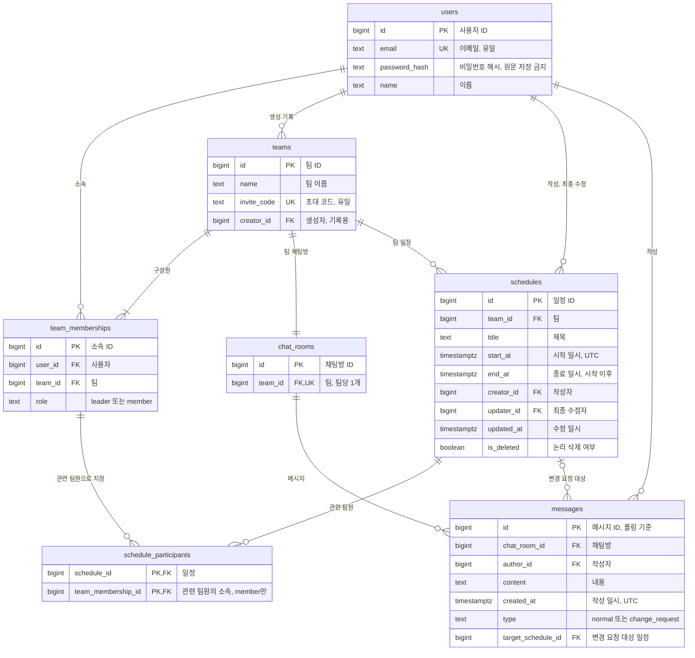

# Team CalTalk ERD (데이터 모델)

버전 0.2 · 최종 수정일 2026-09-30

참조 문서: `docs/1-domain-definition.md` (도메인 정의서 v0.4), `docs/2-PRD.md` (PRD v0.8), `docs/3-user-scenario.md` (사용자 시나리오 v0.2), `docs/5-project-principle.md` (프로젝트 구조 설계 원칙 v0.2), `docs/6-arch-diagram.md` (기술 아키텍처 다이어그램 v0.1)

## 0. 이 문서를 읽는 법

- 도메인 정의서 5장의 엔티티만 테이블로 만든다. 알림, 온라인 상태, 활동 로그, 토큰 저장소, 변경 요청 전용 테이블은 없다(P1-1, N3-3).
- 이름은 설계 원칙 3.4를 따른다. 일시는 모두 `timestamptz`이며 UTC로 저장한다(P1-7).
- **(제안)** 표시는 문서에 정해지지 않아 가장 단순한 값을 고른 것이다. 확정이 아니며 6장에 모았다.
- 근거 ID는 도메인 정의서(BR, UC), PRD(FR, NFR), 설계 원칙(P, B, N, S, T) 번호다.

## 1. ERD

## 2. 테이블별 컬럼

### 2.1 users (사용자)

| 컬럼 | 타입 | 설명 | 근거 |
|------|------|------|------|
| id | bigint | 기본 키, 자동 증가 (제안) | 도메인 5장, 3.4 |
| email | text | 로그인 이메일. 유일 | BR-16, UC-12, FR-01 |
| password_hash | text | 비밀번호 해시. 원문은 저장하지 않고 API 응답에도 담지 않는다 | NFR-04, S5-6 |
| name | text | 이름 | UC-12, FR-01 |

### 2.2 teams (팀)

| 컬럼 | 타입 | 설명 | 근거 |
|------|------|------|------|
| id | bigint | 기본 키 | 도메인 5장 |
| name | text | 팀 이름 | UC-09, FR-04 |
| invite_code | text | 초대 코드. 유일, 추측하기 어려운 무작위 값. 팀장에게만 내려 준다 | BR-12, BR-18, FR-05, S5-10 |
| creator_id | bigint | 팀을 만든 사용자. 기록용이며 팀장 판단에는 쓰지 않는다 | 도메인 5장, NFR-03 |

### 2.3 team_memberships (팀 소속)

| 컬럼 | 타입 | 설명 | 근거 |
|------|------|------|------|
| id | bigint | 기본 키. 관련 팀원 테이블이 이 ID를 참조한다 | 도메인 5장 (Schedule N:N TeamMembership) |
| user_id | bigint | 사용자 | BR-10 |
| team_id | bigint | 팀 | BR-10 |
| role | text | `leader`(팀장) 또는 `member`(팀원). 팀장 여부는 이 값으로만 판단한다 | 도메인 5장, NFR-03, B2-5, 3.4 |

### 2.4 schedules (팀 일정)

| 컬럼 | 타입 | 설명 | 근거 |
|------|------|------|------|
| id | bigint | 기본 키 | 도메인 5장 |
| team_id | bigint | 일정이 속한 팀 | BR-02, BR-09 |
| title | text | 제목 | FR-08 |
| start_at | timestamptz | 시작 일시 (UTC) | FR-08, P1-7 |
| end_at | timestamptz | 종료 일시 (UTC). 시작과 같거나 이후 | BR-14 |
| creator_id | bigint | 작성자(users.id) | 도메인 5장, SC-06 |
| updater_id | bigint | 최종 수정자(users.id). 수정 전에는 비워 둔다 (제안) | FR-09, SC-07 |
| updated_at | timestamptz | 수정 일시. 수정 전에는 비워 둔다 (제안) | FR-09, SC-07 |
| is_deleted | boolean | 논리 삭제 여부. 기본값 false. 행은 지우지 않는다 | BR-15, FR-10, NFR-06, P1-8 |

### 2.5 schedule_participants (관련 팀원)

| 컬럼 | 타입 | 설명 | 근거 |
|------|------|------|------|
| schedule_id | bigint | 일정 | 도메인 5장 |
| team_membership_id | bigint | 관련 팀원의 팀 소속. 같은 팀의 `member`만 | BR-13 |

- 기본 키는 `id` 대신 `(schedule_id, team_membership_id)` 복합 키로 둔다 (제안). 같은 팀원이 한 일정에 두 번 들어가지 않게 하고, 별도 ID가 쓰일 곳이 없다.

### 2.6 chat_rooms (채팅방)

| 컬럼 | 타입 | 설명 | 근거 |
|------|------|------|------|
| id | bigint | 기본 키 | 도메인 5장 |
| team_id | bigint | 팀. 팀당 1개 | BR-17, 도메인 5장 (Team 1:1 ChatRoom) |

### 2.7 messages (메시지)

| 컬럼 | 타입 | 설명 | 근거 |
|------|------|------|------|
| id | bigint | 기본 키. Long Polling의 "마지막 메시지 ID 이후" 기준으로도 쓴다 | 설계 원칙 3.5 poll 경로, B2-10 |
| chat_room_id | bigint | 채팅방 | 도메인 5장 |
| author_id | bigint | 작성자(users.id) | 도메인 5장, FR-11 |
| content | text | 내용 | FR-11 |
| created_at | timestamptz | 작성 일시 (UTC). 기본값 현재 시각. 일자별 조회는 이 값을 한국 표준시로 바꿔 날짜를 나눈다 | BR-07, FR-13, NFR-05 |
| type | text | `normal`(일반) 또는 `change_request`(일정 변경 요청) | 도메인 5장, N3-3, 3.4 |
| target_schedule_id | bigint | 변경 요청 대상 일정. `change_request`이면 필수, `normal`이면 비움. 삭제된 일정도 계속 참조한다 | 도메인 5장, BR-05, BR-15, FR-12 |

- 처리 상태 컬럼은 두지 않는다(BR-06).
- 일자별 채팅 이력은 저장하지 않고 조회로 만든다(도메인 4장).

## 3. 제약 조건

모든 컬럼은 NOT NULL이다. 예외는 표에 "NULL 허용"으로 적었다. 제약 이름은 `테이블_컬럼_종류` 규칙을 따른다(3.4).

| 테이블 | 종류 | 내용 | 근거 |
|--------|------|------|------|
| users | UNIQUE | `email` | BR-16, B2-6 |
| teams | UNIQUE | `invite_code` | BR-12, BR-18, B2-6 |
| teams | FK | `creator_id` → users.id | 도메인 5장 |
| team_memberships | UNIQUE | `(user_id, team_id)` 중복 소속 금지 | UC-10, FR-06, B2-6 |
| team_memberships | CHECK | `role IN ('leader', 'member')` | 3.4 |
| team_memberships | FK | `user_id` → users.id, `team_id` → teams.id | 도메인 5장 |
| schedules | CHECK | `end_at >= start_at` | BR-14, B2-6 |
| schedules | FK | `team_id` → teams.id, `creator_id`·`updater_id` → users.id | 도메인 5장 |
| schedules | NULL 허용 | `updater_id`, `updated_at` (수정 전) (제안) | FR-09 |
| schedules | 기본값 | `is_deleted` = false | FR-10 |
| schedule_participants | PK | `(schedule_id, team_membership_id)` (제안) | 도메인 5장 |
| schedule_participants | FK | `schedule_id` → schedules.id, `team_membership_id` → team_memberships.id | 도메인 5장 |
| chat_rooms | UNIQUE | `team_id` 팀당 채팅방 1개 | BR-17 |
| chat_rooms | FK | `team_id` → teams.id | 도메인 5장 |
| messages | CHECK | `type IN ('normal', 'change_request')` | 3.4, N3-3 |
| messages | CHECK | `(type = 'change_request' AND target_schedule_id IS NOT NULL) OR (type = 'normal' AND target_schedule_id IS NULL)` | 도메인 5장, B2-6 |
| messages | NULL 허용 | `target_schedule_id` (일반 메시지) | 도메인 5장 |
| messages | FK | `chat_room_id` → chat_rooms.id, `author_id` → users.id, `target_schedule_id` → schedules.id | 도메인 5장 |
| messages | 기본값 | `created_at` = 현재 시각 | FR-11 |

- FK의 삭제 동작은 기본값(참조 중이면 삭제 불가)으로 둔다 (제안). 일정은 논리 삭제, 메시지는 무기한 보관, 회원 탈퇴는 제외라 행을 지우는 경우가 없다(NFR-06, PRD 5.2).

## 4. 서비스에서 검사할 규칙

여러 테이블에 걸쳐 있어 DB 제약만으로 막을 수 없는 규칙이다. 설계 원칙 B2-5(권한은 middleware), B2-7(관련 팀원·변경 요청 대상은 서비스)을 따른다.

| 규칙 | 검사 내용 | 검사 위치 | 근거 |
|------|-----------|-----------|------|
| 관련 팀원 범위 | `team_membership_id`가 일정과 같은 팀의 소속이고 `role = 'member'`여야 한다. 팀장이나 다른 팀 사용자는 거부 | services/schedules | BR-13, FR-08, B2-7 |
| 변경 요청 대상 | 보낸 사람이 대상 일정의 관련 팀원이어야 한다. 대상 일정은 같은 팀의 삭제되지 않은 일정이어야 한다 (제안) | services/messages | BR-05, BR-09, UC-06, B2-7 |
| 팀장 1명 | 팀 생성 때만 `leader` 소속을 만들고, 초대 코드 참여는 항상 `member`로 등록한다 | services/teams | BR-11, BR-12 |
| 팀 생성 묶음 | 팀 + 팀장 소속 + 채팅방을 한 트랜잭션으로 저장한다 | services/teams | BR-17, B2-8 |
| 일정 저장 묶음 | 일정 + 관련 팀원을 한 트랜잭션으로 저장·수정한다 | services/schedules | B2-8 |
| 일정 추가·수정·삭제 권한 | 현재 팀의 소속 `role = 'leader'`만 | middleware/team | BR-03, BR-04, B2-5 |
| 팀 소속 | 경로의 팀에 소속된 사용자만. 조회 SQL에도 `team_id` 조건을 넣는다 | middleware/team, services | BR-09, S5-11 |
| 초대 코드 확인 | 팀장에게만 내려 준다 | middleware/team | BR-18, FR-05 |
| 삭제된 일정 숨김 | 캘린더 조회는 `is_deleted = false`만. 메시지의 대상 일정 조회는 삭제 여부와 상관없이 가져와 "삭제됨"으로 표시 | services/schedules, services/messages | BR-15, FR-07, FR-10 |
| 입력 검사 | 빈 값, 이메일 형식, 비밀번호 8자 이상, 일시 형식 | services | NFR-04, S5-7, S5-12 |

## 5. 인덱스

UNIQUE와 PK 제약은 PostgreSQL이 인덱스를 자동으로 만든다.

| 테이블 | 컬럼 | 용도 | 근거 |
|--------|------|------|------|
| messages | `(chat_room_id, created_at)` | 일자별 채팅 이력 조회 | T4-7, FR-13 |
| schedules | `(team_id, start_at, end_at)` | 기간과 겹치는 팀 일정 조회 | T4-7, FR-07 |
| team_memberships | `(user_id, team_id)` | 요청마다 소속·역할 확인. UNIQUE 제약의 인덱스로 충분하다 | T4-7, B2-5 |
| users | `email` | 로그인. UNIQUE 제약의 인덱스 | FR-02 |
| teams | `invite_code` | 초대 코드로 팀 찾기. UNIQUE 제약의 인덱스 | FR-06 |
| chat_rooms | `team_id` | 팀의 채팅방 찾기. UNIQUE 제약의 인덱스 | FR-11 |
| schedule_participants | `(schedule_id, team_membership_id)` | 일정의 관련 팀원 조회, 변경 요청 시 관련 팀원 확인. PK 인덱스 | BR-05 |

- Long Polling의 `id > 마지막 ID` 조회는 T4-7에 없다. 우선 위 인덱스로 시작하고, 부하 확인(T4-6)에서 느리면 `(chat_room_id, id)` 인덱스를 검토한다.

## 6. 제안으로 표시한 항목

| 항목 | 제안 | 대안 |
|------|------|------|
| ID 타입 | `bigint` 자동 증가(`GENERATED ALWAYS AS IDENTITY`). 메시지 폴링의 "마지막 ID 이후" 비교에도 그대로 쓸 수 있다 | uuid |
| 문자열 타입 | 모두 `text`. 길이 제한은 문서에 없어 서비스 입력 검사에서 정한다 | `varchar(n)` |
| 관련 팀원 기본 키 | `(schedule_id, team_membership_id)` 복합 키 | 별도 `id` + UNIQUE |
| 수정 전 `updater_id`, `updated_at` | NULL | 생성 시 작성자·생성 시각으로 채움 |
| 변경 요청 대상 | 삭제된 일정으로는 새 요청을 보낼 수 없음 | 허용 |
| FK 삭제 동작 | 기본값(참조 중이면 삭제 불가) | CASCADE, SET NULL |

## 7. 미결 사항

| ID | 질문 | 영향 | 출처 |
|----|------|------|------|
| ERD-미결-1 | 변경 요청 메시지에 요청 당시 일정 제목·일시 사본을 저장할지. 최신 내용만 보이면 저장하지 않는다. 이 문서는 사본 컬럼을 두지 않았다 | messages 컬럼 | 설계 원칙 미결-8, 와이어프레임 미결-3·4 |
| ERD-미결-2 | 회원 탈퇴 도입 시 작성자 익명화 방식. 지금은 `messages.author_id`를 NOT NULL로 두었고, 탈퇴가 생기면 스키마 변경이 필요하다 | messages, users | BR-20, PRD 5.2·Q-05, 설계 원칙 미결-10 |
| ERD-미결-3 | 일시 저장 기준. PRD는 미결이지만 CLAUDE.md와 설계 원칙을 따라 UTC `timestamptz`로 두었다 | 모든 `~_at` 컬럼 | PRD Q-06, 설계 원칙 미결-2 |
| ERD-미결-4 | 이메일 대소문자를 구분할지. 구분하지 않으려면 소문자로 바꿔 저장하거나 `lower(email)` 유일 인덱스가 필요하다 | users.email 제약 | BR-16 (정해지지 않음) |
| ERD-미결-5 | 제목, 이름, 메시지 내용, 초대 코드의 길이 제한 | 입력 검사, 타입 | 문서에 없음 |
| ERD-미결-6 | 팀장 1명(BR-11)을 DB로도 막을지. `role = 'leader'`인 행에 대해 `team_id` 부분 유일 인덱스를 걸 수 있으나 설계 원칙 B2-6 목록에 없어 넣지 않았다 | team_memberships 인덱스 | BR-11, B2-6 |
| ERD-미결-7 | 로그아웃 시 서버에서 토큰을 무효화하면 토큰 저장 테이블이 필요하다. 지금은 두지 않았다 | 테이블 추가 여부 | 설계 원칙 미결-3 |

## 8. 문서 간 불일치

| 문서 | 내용 | 이 문서의 처리 |
|------|------|----------------|
| 설계 원칙 3.4 vs 도메인 5장 | 외래 키 이름 규칙은 `<대상 단수>_id`인데, 일정의 작성자·최종 수정자 이름이 v0.1에서 `created_by`, `updated_by`였다 | 해결(v0.2): `creator_id`, `updater_id`로 바꿔 규칙과 `teams.creator_id`, `messages.author_id`에 맞췄다 |
| 설계 원칙 3.4 vs 2.5장 | 기본 키는 `id` 규칙인데, 관련 팀원 테이블은 복합 키를 제안했다 | (제안)으로 표시 |
| PRD Q-06 vs CLAUDE.md | 일시 저장 기준 | UTC 저장을 따름 (ERD-미결-3) |
| BR-20 vs PRD 5.2 | 탈퇴 익명화 요구와 탈퇴 기능 제외 | 탈퇴 없는 스키마로 둠 (ERD-미결-2) |

## 9. 변경 이력

문서를 바꿀 때마다 표 맨 아래에 한 줄씩 추가하고, 기존 행은 수정하거나 지우지 않는다. 버전을 올리면 제목 아래의 버전과 최종 수정일도 함께 바꾼다.

| 버전 | 날짜 | 변경자 | 변경 내용 |
|------|------|--------|-----------|
| 0.1 | 2026-09-30 | hyko7 | 초안 작성 (도메인 정의서 v0.4, PRD v0.8, 사용자 시나리오 v0.2, 프로젝트 구조 설계 원칙 v0.2, 기술 아키텍처 다이어그램 v0.1 기반) |
| 0.2 | 2026-09-30 | hyko7 | schedules의 외래 키 이름을 created_by·updated_by에서 creator_id·updater_id로 변경 (설계 원칙 3.4 `<대상 단수>_id` 규칙), 8장 불일치 항목을 해결로 표시 |
