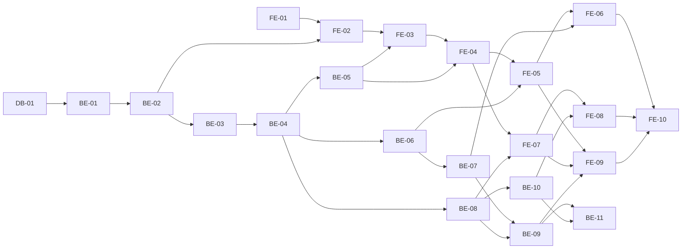

# Team CalTalk 실행 계획 (WBS)

버전 1.0 · 최종 수정일 2026-10-01

참조 문서: `docs/1-domain-definition.md` (도메인 정의서 v0.4), `docs/2-PRD.md` (PRD v0.8), `docs/3-user-scenario.md` (사용자 시나리오 v0.2), `docs/4-wireframes.md` (와이어프레임 v0.5), `docs/5-project-principle.md` (프로젝트 구조 설계 원칙 v0.3), `docs/6-arch-diagram.md` (기술 아키텍처 다이어그램 v0.1), `docs/7-erd.md` (ERD v0.2), `docs/schema.sql`

## 1. 개요

### 1.1 목적

PRD 10장의 2일·1인 일정(D1 백엔드, D2 화면·검증)을 데이터베이스(DB), 백엔드(BE), 프론트엔드(FE) Task로 나눈다. Task 하나는 반나절 이하로 끝나고 한 번에 테스트할 수 있는 크기다. 이 문서에는 코드가 없다.

### 1.2 Task를 쓰는 방법 (개발 스킬 연동)

- `develop-backend`, `develop-frontend` 스킬은 Task 번호(예: `BE-03`)를 받아 이 문서의 `### BE-03 ...` 제목 아래 내용을 읽는다.
- 스킬은 테스트가 통과하면 그 Task의 **완료 조건** 체크박스(`- [ ]`)를 `- [x]`로 바꾼다. 재시도는 3회까지이며, 미충족 조건은 보고한다.
- 완료 조건은 검증할 수 있는 문장으로 썼고, 근거 ID(FR, BR, NFR, SC, WF, 설계 원칙)를 괄호에 적었다. `[T4-3]`은 설계 원칙 T4-3의 필수 자동 테스트 항목이라는 표시다.
- "착수 전 결정 필요"가 붙은 Task는 8장의 결정을 먼저 받고 시작한다.
- 스킬이 이 문서를 `docs/5-plan.md`로 참조하는 문제는 8장 결정-3이다.

### 1.3 범위 밖 (Task로 만들지 않는다)

알림, 온라인 사용자, 최근 활동 표시줄, [오늘로 이동], 채팅 상단 [□] [×], 회원 탈퇴, 파일 첨부, 외부 연동, 반복 일정, 충돌 자동 감지, 변경 요청 처리 상태(PRD 5.2, 설계 원칙 P1-1·미결-1). 와이어프레임 WF-04에 그려져 있어도 만들지 않는다.

## 2. Task 요약

| ID | 제목 | 영역 | 선행 Task | 일차 |
|----|------|------|-----------|------|
| DB-01 | 스키마 적용과 제약 확인 | DB | 없음 | D1 |
| BE-01 | 백엔드 프로젝트 골격 | BE | DB-01 | D1 |
| BE-02 | 회원가입·로그인 API | BE | BE-01 | D1 |
| BE-03 | 로그인·팀 소속·팀장 확인 미들웨어 | BE | BE-02 | D1 |
| BE-04 | 팀 생성·내 팀 목록·구성원 목록 API | BE | BE-03 | D1 |
| BE-05 | 초대 코드 확인·팀 참여 API | BE | BE-04 | D1 |
| BE-06 | 일정 추가·기간 조회 API | BE | BE-04 | D1 |
| BE-07 | 일정 수정·삭제(논리 삭제) API | BE | BE-06 | D1 |
| BE-08 | 메시지 전송·일자별 조회 API | BE | BE-04 | D1 |
| BE-09 | 일정 변경 요청 메시지 API | BE | BE-07, BE-08 | D1 |
| BE-10 | Long Polling 새 메시지 수신 API | BE | BE-08 | D1 |
| FE-01 | 프론트엔드 프로젝트 골격 | FE | 없음 | D2 |
| FE-02 | 회원가입·로그인 화면과 로그아웃 | FE | FE-01, BE-02 | D2 |
| FE-03 | 팀 시작 화면과 로그인 후 분기 | FE | FE-02, BE-05 | D2 |
| FE-04 | 팀 메인 레이아웃·팀 전환·초대 코드 | FE | FE-03, BE-05 | D2 |
| FE-05 | 캘린더 월·주·일 조회 | FE | FE-04, BE-06 | D2 |
| FE-06 | 일정 입력·수정·삭제 창 (팀장) | FE | FE-05, BE-07 | D2 |
| FE-07 | 채팅 목록·전송·일자별 조회 | FE | FE-04, BE-08 | D2 |
| FE-08 | Long Polling 수신 | FE | FE-07, BE-10 | D2 |
| FE-09 | 변경 요청 보내기와 "삭제됨" 표시 | FE | FE-05, FE-07, BE-09 | D2 |
| FE-10 | 통합 확인 (화면에서 SC 확인) | FE | FE-06, FE-08, FE-09 | D2 |
| BE-11 | 동시 접속 1,000명 확인 (NFR-01) | BE | BE-09, BE-10 | D2 |

- D1은 11개(DB 1, BE 10), D2는 11개(FE 10, BE 1)다. PRD 10장 D1의 "FR-01~13, FR-15, FR-16 서버 쪽 수용 기준"은 DB-01~BE-10으로 채운다.
- 반나절 Task 11개는 하루보다 많다. 일정이 모자라면 무엇을 줄일지가 필요하다 → 결정-13 (PRD Q-08, R-01).

## 3. 의존 관계와 실행 순서

권장 실행 순서 (1인, 위에서 아래로)

| 일차 | 순서 |
|------|------|
| D1 | DB-01 → BE-01 → BE-02 → BE-03 → BE-04 → BE-05 → BE-06 → BE-07 → BE-08 → BE-09 → BE-10 |
| D2 | FE-01 → FE-02 → FE-03 → FE-04 → FE-05 → FE-06 → FE-07 → FE-08 → FE-09 → FE-10 → BE-11 |

- BE-11은 PRD 10장 D2 순서(화면 → 통합 확인 → 동시 접속 확인)에 맞춰 맨 뒤에 둔다. 기능상 선행은 BE-09, BE-10뿐이다.
- 반응형 확인은 별도 Task 없이 FE-04(레이아웃)와 FE-10(통합 확인)에서 한다.

## 4. 공통 규칙

### 4.1 파일 경로와 도구

- 코드 경로는 설계 원칙 6장(프론트엔드), 7장(백엔드) 구조를 따른다. 트리에 없는 폴더는 만들지 않는다(P1-2).
- 스키마는 `docs/schema.sql`이다. 마이그레이션 도구는 쓰지 않는다.
- 아래 도구는 설계 원칙 8장의 **(제안)** 이며, 이 계획은 그대로 쓴다: Vite, React Router, ES 모듈, `crypto.scrypt`, `jsonwebtoken`, `node:test` + `fetch`, Vitest(최소), ESLint·Prettier 기본 설정, 연결 풀 10 안팎, 토큰은 `localStorage`, Long Polling 대기 상한 약 25초.
- 백엔드 테스트는 실제 PostgreSQL 테스트용 DB로 API를 호출한다. DB는 모의하지 않는다(T4-2). 테스트 파일은 `backend/test/<기능>.test.js`, 공통 도우미는 `backend/test/helpers.js`다.
- 요구사항을 구현한 곳에는 주석으로 ID를 한 줄 적는다(P1-4). 커밋 메시지에도 ID를 쓴다.

### 4.2 완료 조건 공통 항목

- 모든 BE Task의 마지막 완료 조건: 전체 `npm test` 통과, 그 Task 코드의 커버리지 80% 이상(스킬 기준, `node --test --experimental-test-coverage`).
- 모든 FE Task의 마지막 완료 조건: `npx tsc --noEmit` 통과(T4-8) + 검증 방식은 결정-1에 따른다. (가) 자동 테스트 채택이면 커버리지 90% 이상, (나) 최소 테스트 채택이면 위 조건을 화면에서 직접 확인하고 결과를 기록한다. 조건 문장은 어느 쪽으로도 확인할 수 있게 동작으로 썼다.

### 4.3 T4-3 필수 자동 테스트가 들어 있는 Task

| T4-3 항목 | Task |
|-----------|------|
| 팀원의 일정 추가 거부 (BR-03) | BE-06 |
| 팀원의 일정 수정·삭제 거부 (BR-03, BR-04) | BE-07 |
| 다른 팀 일정·채팅 접근 거부 (BR-09) | BE-03(공통), BE-06, BE-07, BE-08, BE-10 |
| 팀원의 초대 코드 확인 거부 (BR-18) | BE-05 |
| 관련 팀원 규칙 (BR-13) | BE-06, BE-07 |
| 종료 < 시작 거부 (BR-14) | BE-06, BE-07 |
| 관련 팀원 아닌 일정의 변경 요청 거부 (BR-05) | BE-09 |
| 비밀번호 8자 미만 거부 (NFR-04) | BE-02 |
| 삭제된 일정 참조 메시지 유지 (BR-15) | BE-07, BE-09 |
| 한국 표준시 경계 (T4-4) | BE-06, BE-08 |
| 동시 접속 확인 (T4-6) | BE-11 |

### 4.4 요구사항 → Task

| 요구사항 | Task |
|----------|------|
| FR-01 | BE-02, FE-02 |
| FR-02 | BE-02, BE-03, FE-01, FE-02 |
| FR-03 | BE-04, FE-03, FE-04 |
| FR-04 | BE-04, FE-03 |
| FR-05 | BE-05, FE-04 |
| FR-06 | BE-05, FE-03 |
| FR-07 | BE-06, FE-05 |
| FR-08 | BE-06, FE-06 |
| FR-09 | BE-07, FE-06 |
| FR-10 | BE-07, BE-09, FE-06, FE-09 |
| FR-11 | BE-08, BE-10, FE-07, FE-08 |
| FR-12 | BE-09, FE-09 |
| FR-13, FR-15 | BE-08, FE-07 |
| FR-14 | FE-04 |
| FR-16 | FE-02, FE-04 (서버 경로 없음) |
| NFR-01 | BE-10, BE-11 |
| NFR-03 | BE-03과 각 API Task |
| NFR-04 | BE-02 |
| NFR-05 | BE-08, FE-01 |
| NFR-06 | BE-07, BE-08 |

## 5. DB Task

### DB-01 스키마 적용과 제약 확인

- 영역·일차: DB · D1
- 선행 Task: 없음
- 관련 요구사항: BR-11, BR-12, BR-14, BR-16, BR-17, UC-10, NFR-04, NFR-06, B2-6, T4-7, ERD 3·5장
- 착수 전 결정 필요: 결정-5 (요청 당시 일정 사본 컬럼), 결정-12 (팀장 1명 DB 제약). 결정 결과 스키마 변경이 필요할 때만 `docs/schema.sql`을 고친다.

**수행 작업**
- PostgreSQL 18에 개발용 DB와 테스트용 DB를 만든다.
- `docs/schema.sql`을 두 DB에 실행한다(`psql`로 직접 실행, 마이그레이션 도구 없음). 스키마는 이미 작성되어 있으므로 새로 쓰지 않는다.
- `psql`로 규칙 위반 INSERT를 실행해 DB 제약이 막는지 확인한다.

**완료 조건**
- [x] 두 DB에서 `docs/schema.sql`이 오류 없이 실행되고 테이블 7개(users, teams, team_memberships, chat_rooms, schedules, schedule_participants, messages)가 생긴다 (ERD 2장)
- [x] 같은 이메일로 users를 두 번 INSERT하면 `users_email_key` 위반이다 (BR-16)
- [x] 같은 초대 코드로 teams를 두 번 INSERT하면 `teams_invite_code_key` 위반이다 (BR-12)
- [x] 같은 (user_id, team_id)를 team_memberships에 두 번 INSERT하면 위반이다 (UC-10)
- [x] role에 `admin`을 넣으면 CHECK 위반이다 (설계 원칙 3.4)
- [x] 같은 팀의 chat_rooms를 두 번 INSERT하면 위반이다 (BR-17)
- [x] `end_at < start_at`인 schedules INSERT는 위반이고, `end_at = start_at`은 성공한다 (BR-14)
- [x] type이 `change_request`인데 target_schedule_id가 NULL이면 위반이고, type이 `normal`인데 target_schedule_id가 있어도 위반이다 (도메인 정의서 5장)
- [x] 인덱스 `messages_chat_room_id_created_at_idx`, `schedules_team_id_start_at_end_at_idx`가 있다 (T4-7)
- [x] 결정-5, 결정-12로 스키마를 바꾼 경우 `docs/schema.sql`과 `docs/7-erd.md`를 함께 고치고 두 문서의 변경 이력을 갱신했다 (바꾸지 않았으면 해당 없음으로 기록) → 해당 없음: 결정-5, 결정-12가 아직 미정이라 스키마를 바꾸지 않았다

**진행 결과 (2026-09-30)**
- postgresql-mcp로 개발용 DB `team_caltalk`, 테스트용 DB `team_caltalk_test`를 만들고 `docs/schema.sql`을 적용했다. DB 이름은 문서에 없어 이 이름으로 정했다.
- 제약 확인은 `team_caltalk_test`에서 규칙 위반 INSERT로 했고, 확인 뒤 넣은 데이터는 모두 지웠다(행 0개).

## 6. BE Task

### BE-01 백엔드 프로젝트 골격

- 영역·일차: BE · D1
- 선행 Task: DB-01
- 관련 요구사항: NFR-04, B2-1, B2-8, B2-9, S5-1~S5-4, S5-13~S5-15, A3-5, T4-2

**수행 작업**
- `backend/package.json`(ES 모듈, `start`·`test` 스크립트), `backend/.env.example`(키 이름만)을 만든다. `.gitignore`에 `.env`를 넣는다(S5-4).
- `backend/src/config.js`: 환경변수 `PORT`, `DATABASE_URL`, `JWT_SECRET`, `JWT_EXPIRES_IN`, 프론트엔드 주소를 읽고 검사한다. 필수 값이 없으면 시작 단계에서 오류를 내고 멈춘다.
- `backend/src/config.js`는 `NODE_ENV=test`일 때 `backend/.env.test`(테스트용 DB `team_caltalk_test`)를, 그 밖에는 `backend/.env`를 읽는다. `.env.test`는 Git에서 제외하고 `.env.test.example`(키 이름만)을 올린다.
- `backend/src/db.js`: pg 연결 풀(크기는 `DB_POOL_SIZE`, 기본 10), 파라미터 바인딩 `query`, 트랜잭션 도우미(오류 시 롤백).
- `backend/src/lib/httpError.js`, `backend/src/middleware/errorHandler.js`: 상태 코드가 담긴 오류를 `{ "message": "..." }`로 바꾸고 요청 로그 한 줄을 남긴다.
- `backend/src/app.js`(Express 설정, CORS, JSON 본문, 없는 경로 404, 오류 처리 연결), `backend/src/server.js`(포트 열기).
- `backend/test/helpers.js`: 테스트 DB 테이블 비우기, 서버 기동·종료 도우미. (사용자 만들기·토큰 받기 도우미는 BE-02로 옮김)

**완료 조건**
- [x] `npm test`가 실행되고, 테스트용 DB에 연결해 쿼리를 실행한다 (T4-2)
- [x] `DATABASE_URL` 또는 `JWT_SECRET`이 없으면 서버가 시작 단계에서 오류로 종료한다 (S5-2)
- [x] `config.js` 밖에서 `process.env`를 읽는 코드가 없다 (S5-1)
- [x] `.env.example`에 키 이름만 있고 값은 비어 있으며, `.env`는 Git 추적 대상이 아니다 (S5-4)
- [x] 트랜잭션 도우미는 중간에 오류가 나면 앞서 실행한 INSERT를 되돌린다 (B2-8)
- [x] 없는 경로 요청은 404 `{ "message": ... }`, 서비스가 던진 400·401·403·404·409 오류는 해당 상태 코드와 `{ "message": ... }`로 응답한다 (A3-5)
- [x] 예상하지 못한 오류는 500으로 응답하고 SQL·스택 같은 내부 정보를 응답에 담지 않는다 (S5-14)
- [x] 요청 로그는 logger로만 남고(`NODE_ENV=development`에서만 출력) 메서드, 경로, 상태 코드, 소요 시간이 들어 있으며 비밀번호·토큰·메시지 본문은 로그에 없다 (S5-13)
- [x] 프론트엔드 주소가 아닌 Origin의 브라우저 요청은 CORS로 허용되지 않는다 (S5-3)
- [x] 전체 `npm test` 통과, 이 Task 코드 커버리지 80% 이상 (스킬 기준)

**진행 결과 (2026-10-01, 이슈 #1, 브랜치 feature-1)**
- `NODE_ENV=test`로 `npm test` 실행: 37개 통과, 실패 0, 전체 커버리지 lines 96.89%(기준 80%). 테스트는 테스트용 DB `team_caltalk_test`를 썼고, 개발 DB(team_caltalk)의 seed 데이터는 그대로다.
- 요청 로그 소요 시간은 밀리초 단위 숫자로 남긴다. 사용자 ID·팀 ID는 로그인 기능이 생기는 BE-03에서 요청 로그에 추가한다.
- 없는 경로 404도 오류 처리기를 거치므로 오류 로그가 함께 남는다(개발 환경에서만 출력).

### BE-02 회원가입·로그인 API

- 영역·일차: BE · D1
- 선행 Task: BE-01
- 관련 요구사항: FR-01, FR-02, UC-12, UC-01, BR-01, BR-16, NFR-04, NFR-08, SC-01, SC-02, S5-6~S5-9, S5-12
- 착수 전 결정 필요: 설계 원칙 미결-3 중 `JWT_EXPIRES_IN` 값 (결정-4), ERD-미결-4·5의 이메일 대소문자·길이 제한 (결정-11)

**수행 작업**
- `backend/src/services/auth.js`: 회원가입, 로그인, 비밀번호 해시(`crypto.scrypt`, 제안), 해시 확인, JWT 발급(`jsonwebtoken`, 제안). JWT에는 사용자 ID만 담는다(S5-8).
- `backend/src/routes/auth.js`: `POST /api/auth/signup`(201), `POST /api/auth/login`(200, 토큰과 사용자 id·이름 반환). 두 경로는 토큰 검사를 하지 않는다.
- 로그아웃 서버 경로는 만들지 않는다(설계 원칙 7장, 미결-3).
- `backend/test/auth.test.js`

**완료 조건**
- [x] 정상 가입 요청이 201이고, 응답에 비밀번호·해시가 없다 (SC-01, S5-6)
- [x] DB의 `password_hash`가 입력한 비밀번호 원문과 다르다 (NFR-04) [T4-3]
- [x] 이미 가입한 이메일로 가입하면 409이고 계정이 늘지 않는다 (BR-16, SC-01 E1)
- [x] 비밀번호 7자는 400, 8자는 201이다 (FR-01, NFR-04, SC-01 E2) [T4-3]
- [x] 이메일·이름이 비었거나 이메일 형식이 아니면 400이다 (S5-12)
- [x] 로그인 성공 시 토큰을 받고, 토큰에는 사용자 ID만 있고 역할·팀 정보가 없다 (FR-02, S5-8)
- [x] 틀린 비밀번호와 없는 이메일은 같은 401 메시지로 응답한다 (SC-02 E1)
- [x] 이메일에 `' OR 1=1 --` 같은 문자열을 넣어도 로그인이 401이다 (NFR-04, B2-9)
- [x] 로그에 비밀번호와 토큰이 남지 않는다 (S5-13)
- [x] `backend/test/helpers.js`에 사용자 만들기·토큰 받기 도우미가 있고, 이 Task의 테스트에서 쓴다 (BE-01에서 옮김)
- [x] 전체 `npm test` 통과, 이 Task 코드 커버리지 80% 이상 (스킬 기준)

**진행 결과 (2026-10-01, 이슈 #2, 브랜치 feature-2)**
- `NODE_ENV=test`로 `npm test` 실행: 63개 통과, 실패 0, 전체 커버리지 lines 97.18%(기준 80%). 테스트용 DB `team_caltalk_test`만 썼고, 개발 DB(team_caltalk)의 seed 데이터(users 10, messages 50)는 그대로다.
- 이 Task에서 정한 값 (결정-4, 결정-11 중 BE-02 관련 부분):
  - 토큰 유효 기간 `7d`(단위를 꼭 붙인다. 숫자만 쓰면 밀리초로 읽힌다). 토큰 payload는 `exp`, `iat`, `sub`뿐이고 `sub`는 사용자 id 문자열이다. BE-03은 `payload.sub`로 읽는다.
  - 이메일은 대소문자를 구분하지 않는다(앞뒤 공백을 지우고 소문자로 저장·조회). 이름은 앞뒤 공백을 지운 값을 저장한다. 길이 제한은 두지 않았다(문서에 값이 없음).
  - 가입·로그인 응답의 사용자 정보는 `{ id, name }`이다. 로그인에는 이메일 형식 검사를 하지 않는다.
  - `db.js`에서 DB의 bigint를 숫자로 바꾼다(`pg.types.setTypeParser(20, Number)`). swagger의 id가 integer라서다. 이후 모든 Task의 bigint 컬럼(id, count 등)이 숫자로 온다.
  - 비밀번호 해시는 `salt:key`(hex) 형식이다. 이 형식이 아닌 저장값(seed의 자리 표시 해시)은 로그인이 401이다. 그래서 `docs/seed.sql`의 사용자 10명은 로그인할 수 없다.
  - 사용자 만들기·토큰 받기 도우미는 `backend/test/helpers.js`의 `createUserAndLogin`이다.

### BE-03 로그인·팀 소속·팀장 확인 미들웨어

- 영역·일차: BE · D1
- 선행 Task: BE-02
- 관련 요구사항: BR-01, BR-03, BR-09, BR-10, NFR-03, NFR-08, SC-02, SC-14, B2-5, S5-8, S5-9, S5-11, R-03

**수행 작업**
- `backend/src/middleware/auth.js`: `Authorization: Bearer` 토큰을 확인해 로그인 사용자를 `req`에 싣는다.
- `backend/src/middleware/team.js`: 경로의 `:teamId`에 소속되어 있는지 매 요청 DB로 확인하고, 내 소속 ID와 역할을 `req`에 싣는다. 팀장 전용 검사도 여기서 한다.
- 검사 순서는 로그인 → 소속 → 팀장이다(아키텍처 4장).
- 제품 라우트 없이 확인하려면 테스트 파일 안에서 임시 라우트를 붙여 쓴다(제품 코드에 넣지 않는다).
- `backend/test/middleware.test.js`

**완료 조건**
- [x] 토큰이 없으면 401이다 (BR-01, SC-02 E2)
- [x] 형식이 틀린 토큰, 서명이 다른 토큰, 만료된 토큰은 401이다 (SC-02 E3, NFR-08)
- [x] `/api/auth/signup`, `/api/auth/login`은 토큰 없이 통과한다 (S5-9)
- [x] 소속되지 않은 팀의 `:teamId` 요청은 403이고 응답에 데이터가 없다 (BR-09, S5-11) [T4-3]
- [x] 존재하지 않는 팀 ID도 소속되지 않은 팀과 같은 403이다 (S5-11)
- [x] 숫자가 아닌 `:teamId`는 400이다 (S5-12)
- [x] 팀원이 팀장 전용 경로를 요청하면 403이고, 팀장은 통과한다 (BR-03, B2-5)
- [x] 한 사용자가 팀 A에서는 팀장, 팀 B에서는 팀원일 때 각 팀 경로에서 그 팀 기준 역할로 판단한다 (BR-10, SC-14)
- [x] 토큰 발급 뒤 DB의 역할을 바꾸면 다음 요청부터 바뀐 역할로 판단한다 (S5-8)
- [x] 검사 순서가 로그인 → 소속 → 팀장이다: 토큰 없는 요청은 팀 소속과 상관없이 401이다 (아키텍처 4장)
- [x] 전체 `npm test` 통과, 이 Task 코드 커버리지 80% 이상 (스킬 기준)

**진행 결과 (2026-10-01, 이슈 #3, 브랜치 feature-3)**
- `NODE_ENV=test`로 `npm test` 실행: 90개 통과(기존 63개 + 이번 27개), 실패 0, 전체 커버리지 lines 98.41%(기준 80%). 새 미들웨어 `auth.js`, `team.js`는 줄·분기 모두 100%다. 테스트용 DB `team_caltalk_test`만 썼고, 개발 DB(team_caltalk)의 seed 데이터는 그대로다.
- 미들웨어와 요청에 싣는 값 (BE-04 이후 Task가 이 이름으로 쓴다):
  - `middleware/auth.js`의 `requireLogin` → `req.user = { id }`(숫자). `middleware/team.js`의 `requireTeamMember` → `req.team = { id, membershipId, role }`(`id`는 숫자 팀 ID, `role`은 `'leader'` 또는 `'member'`), `requireLeader`.
  - 라우트 조립 순서는 `requireLogin, requireTeamMember, requireLeader`이다. `requireLeader`는 함수 호출(`requireLeader()`)이 아니라 그대로 넣는다(팩토리가 아님).
  - 팀장 전용 403 문구는 `팀장만 할 수 있습니다` 하나다. 초대 코드 경로(BE-05)의 swagger 예시 문구 `팀장만 초대 코드를 볼 수 있습니다`는 BE-05에서 따로 처리한다.
  - 토큰 검사는 알고리즘을 HS256으로 고정하고, 사용자 ID(`sub`)는 `/^[1-9]\d*$/`와 안전 정수만 허용한다. 모든 실패는 같은 401 `로그인이 필요합니다`이고 원래 오류는 다시 던지지 않는다. 사용자가 DB에 있는지는 조회하지 않는다(탈퇴 기능이 범위 밖이고, 삭제된 사용자는 팀 소속이 없어 403이 된다).
  - 팀 ID는 `/^[1-9]\d*$/`와 안전 정수만 허용하고 아니면 400이다. 존재하지 않는 팀과 소속이 아닌 팀은 같은 403 `접근 권한이 없습니다`이다(`teams`는 조회하지 않는다).
- 요청 로그에 `userId`(로그인한 요청), `teamId`(팀 소속을 통과한 요청)가 값이 있을 때만 들어간다. 401로 끝난 요청에는 키가 없고(키 4개 유지), 400·403으로 끝난 요청에는 `teamId`가 없다.
- `app.js`에는 팀 경로를 연결하지 않았다(BE-04부터). 미들웨어는 테스트 파일 안의 별도 앱에 임시 경로를 붙여 검증했다. 팀 경로를 연결할 때는 `POST /api/teams/join`을 `/:teamId` 경로보다 먼저 정의해야 `join`이 팀 ID로 읽히지 않는다.
- 테스트 도우미 `createTeam(creatorId)`, `addMember(userId, teamId, role)`를 `backend/test/helpers.js`에 추가했다.

### BE-04 팀 생성·내 팀 목록·구성원 목록 API

- 영역·일차: BE · D1
- 선행 Task: BE-03
- 관련 요구사항: FR-03, FR-04, UC-09, BR-10, BR-11, BR-17, BR-19, SC-02, SC-03, SC-14, S5-10, B2-8, WF-03, WF-09
- 착수 전 결정 필요: 팀 이름 길이 제한 (결정-11)

**수행 작업**
- `backend/src/services/teams.js`: `createTeam`(팀 + 팀장 소속 + 채팅방을 한 트랜잭션, 초대 코드는 무작위 값), `listMyTeams`(팀 ID, 이름, 내 역할), `listMembers`(소속 ID, 사용자 ID, 이름, 역할).
- `backend/src/routes/teams.js`: `POST /api/teams`(201), `GET /api/teams`, `GET /api/teams/:teamId/members`. 역할은 프론트엔드가 버튼 표시에 쓸 수 있게 목록에 포함한다(F2-8).
- `backend/test/teams.test.js`

**완료 조건**
- [x] `POST /api/teams`가 201이고, 만든 사용자가 `leader`로 소속되며 teams·team_memberships·chat_rooms에 각각 1행이 생긴다 (BR-11, BR-17, UC-09)
- [x] 팀 생성 도중 오류를 일으키면 팀·소속·채팅방이 하나도 남지 않는다 (B2-8)
- [x] 초대 코드는 무작위 값이며 팀마다 다르다 (BR-12, S5-10)
- [x] 팀 이름이 비어 있으면 400이다 (S5-12)
- [x] `GET /api/teams`는 내가 소속된 팀만 돌려주고 각 항목에 내 역할이 있으며 초대 코드는 없다 (BR-10, BR-19, S5-10)
- [x] 소속 팀이 없는 사용자는 빈 목록을 받는다 (SC-02, WF-03)
- [x] 한 사용자가 팀 A 팀장, 팀 B 팀원이면 목록에서 팀마다 다른 역할이 나온다 (BR-10, SC-14)
- [x] `GET /api/teams/:teamId/members`는 그 팀 구성원만 돌려주고 비밀번호 해시가 없다 (BR-09, S5-6)
- [x] 소속되지 않은 사용자가 구성원 목록을 요청하면 403이다 (BR-09) [T4-3]
- [x] 토큰 없이 세 경로를 요청하면 401이다 (BR-01)
- [x] 전체 `npm test` 통과, 이 Task 코드 커버리지 80% 이상 (스킬 기준)

**진행 결과 (2026-10-01, 이슈 #4, 브랜치 feature-4)**
- `NODE_ENV=test`로 `npm test` 실행: 106개 통과, 실패 0, 전체 커버리지 lines 98.66%(기준 80%). `services/teams.js`·`routes/teams.js`는 줄·분기 100%. 테스트용 DB `team_caltalk_test`만 썼다.
- 이 Task에서 정한 값 (결정-11 중 BE-04 부분):
  - 팀 이름은 앞뒤 공백을 지운 값을 저장하고, 문자열이 아니거나 비면 400 `팀 이름을 입력해 주세요`. 길이 제한은 두지 않았다(문서에 값이 없음).
  - 초대 코드는 `crypto.randomBytes(9).toString('base64url')`(12자). 재시도 없이 `teams_invite_code_key`가 유일성을 보장한다. 응답에는 넣지 않는다(BE-05의 `invite-code` 경로가 보여 준다).
  - 팀 생성 INSERT 순서는 teams → team_memberships(`leader`) → chat_rooms이고 한 트랜잭션이다. 그래서 팀마다 채팅방이 항상 1개다(BE-08이 가정해도 된다).
  - 응답: `POST /api/teams` 201 `{ id, name, role: 'leader' }`, `GET /api/teams` `[{ id, name, role }]`(`teams.id` 오름차순), 구성원 목록 `[{ membershipId, userId, name, role }]`(`team_memberships.id` 오름차순, 이메일·해시 없음). 구성원 목록은 팀원도 볼 수 있다(`requireLeader` 미사용).
  - 롤백 테스트는 `chat_rooms`에 임시 CHECK 제약(`NOT VALID`)을 걸어 세 번째 INSERT를 실패시키고, `finally`에서 제약을 지운다(`--test-concurrency=1` 전제).

### BE-05 초대 코드 확인·팀 참여 API

- 영역·일차: BE · D1
- 선행 Task: BE-04
- 관련 요구사항: FR-05, FR-06, UC-09, UC-10, BR-10, BR-11, BR-12, BR-18, SC-03, SC-04, S5-10

**수행 작업**
- `backend/src/services/teams.js`에 초대 코드 조회, 코드로 참여(항상 `member`로 등록)를 추가한다.
- `backend/src/routes/teams.js`에 `GET /api/teams/:teamId/invite-code`(팀장 전용), `POST /api/teams/join`을 추가한다. `join`은 `:teamId` 경로보다 먼저 등록한다.
- `backend/test/teams.test.js`에 추가한다.

**완료 조건**
- [ ] 팀장이 초대 코드를 요청하면 200과 코드를 받는다 (FR-05)
- [ ] 팀원이 초대 코드를 요청하면 403이다 (BR-18, SC-03 E1) [T4-3]
- [ ] 소속되지 않은 사용자가 초대 코드를 요청하면 403이다 (BR-09)
- [ ] 유효한 코드로 `POST /api/teams/join`하면 201이고 `member` 역할로 소속된다 (FR-06, BR-12)
- [ ] 참여로 `leader`가 만들어지는 경우는 없다 (BR-11)
- [ ] 없는 코드로 참여하면 404이고 어느 팀에도 등록되지 않는다 (SC-04 E1)
- [ ] 이미 소속된 팀의 코드로 참여하면 409이고 소속 행은 1개로 유지된다 (SC-04 E2, UC-10)
- [ ] 같은 사용자가 같은 코드로 동시에 두 번 요청해도 소속 행은 1개다 (UC-10, B2-6)
- [ ] 초대 코드가 `GET /api/teams`, 구성원 목록, 참여 응답에는 없다 (S5-10)
- [ ] 코드가 비어 있으면 400, 토큰이 없으면 401이다 (S5-12, BR-01)
- [ ] 전체 `npm test` 통과, 이 Task 코드 커버리지 80% 이상 (스킬 기준)

### BE-06 일정 추가·기간 조회 API

- 영역·일차: BE · D1
- 선행 Task: BE-04
- 관련 요구사항: FR-07, FR-08, UC-02, UC-03, BR-02, BR-03, BR-09, BR-13, BR-14, SC-05, SC-06, T4-3, T4-4, R-04, B2-7, B2-8
- 착수 전 결정 필요: 제목 길이 제한, 관련 팀원 0명 허용 여부(와이어프레임 A-7) (결정-11)

**수행 작업**
- `backend/src/services/schedules.js`: `createSchedule`(일정 + 관련 팀원을 한 트랜잭션), `listSchedules`. 입력 검사(제목, 시각 형식, 종료 ≥ 시작, 관련 팀원 범위)는 서비스에서 SQL로 한다.
- `backend/src/routes/schedules.js`: `POST /api/teams/:teamId/schedules`(팀장 전용, 201), `GET /api/teams/:teamId/schedules?from=&to=`(구성원). `from`, `to`는 ISO 8601 시각이며 화면이 한국 표준시 경계를 UTC로 바꿔 보낸다(제안).
- 요청의 관련 팀원은 소속 ID 목록으로 받고(제안), 응답의 일정에는 관련 팀원(소속 ID, 사용자 ID, 이름)을 포함한다. 프론트엔드가 "내가 관련 팀원인 일정"을 가려낼 수 있어야 한다(WF-10, F2-2).
- 기간과 겹치는 조건의 경계(시작 = 종료인 일정, 종료가 기간 시작과 같은 일정)를 정하고 테스트로 고정한다.
- `backend/test/schedules.test.js`

**완료 조건**
- [ ] 팀장이 일정을 추가하면 201이고 응답에 제목, 시작·종료(UTC ISO), 관련 팀원, 작성자 ID가 있다 (FR-08, SC-06)
- [ ] 팀원이 일정을 추가하면 403이고 일정이 저장되지 않는다 (BR-03, SC-06 E4) [T4-3]
- [ ] 다른 팀 경로로 일정을 추가하면(다른 팀의 팀장·팀원 모두) 403이다 (BR-09) [T4-3]
- [ ] 종료가 시작보다 앞서면 400, 같으면 201이다 (BR-14, SC-06 E1) [T4-3]
- [ ] 관련 팀원에 팀장의 소속 ID를 넣으면 400이고 일정이 저장되지 않는다 (BR-13, SC-06 E2) [T4-3]
- [ ] 관련 팀원에 다른 팀의 소속 ID를 넣으면 400이고 일정이 저장되지 않는다 (BR-13, SC-06 E3) [T4-3]
- [ ] 존재하지 않는 소속 ID를 넣으면 400이다 (B2-7)
- [ ] 일정 저장 도중 관련 팀원 저장이 실패하면 일정 행도 남지 않는다 (B2-8)
- [ ] 제목이 비었거나 시각 형식이 틀리면 400이다 (S5-12)
- [ ] 팀장과 팀원이 같은 기간을 조회하면 같은 일정을 본다 (BR-02, SC-05)
- [ ] 한국 표준시 2026-09-09 23:30 ~ 09-10 00:30 일정은 09-09 조회와 09-10 조회에 모두 나오고, 09-10 00:00에 시작하는 일정은 09-09 조회에 나오지 않는다 (SC-05, T4-4, R-04) [T4-3]
- [ ] 다른 팀의 일정은 조회 결과에 없다 (BR-09, FR-07)
- [ ] 소속되지 않은 팀의 일정을 조회하면 403이다 (SC-05 E1, S5-11) [T4-3]
- [ ] `is_deleted = true`인 일정은 조회 결과에 없다 (SC-05 E2)
- [ ] `from`, `to`가 없거나 형식이 틀리면 400이다 (S5-12)
- [ ] 전체 `npm test` 통과, 이 Task 코드 커버리지 80% 이상 (스킬 기준)

### BE-07 일정 수정·삭제(논리 삭제) API

- 영역·일차: BE · D1
- 선행 Task: BE-06
- 관련 요구사항: FR-09, FR-10, UC-04, UC-11, BR-03, BR-04, BR-09, BR-13, BR-14, BR-15, NFR-06, SC-07, SC-08, S5-11

**수행 작업**
- `backend/src/services/schedules.js`에 `updateSchedule`(입력 검사는 BE-06과 같음, 관련 팀원 교체는 한 트랜잭션, 최종 수정자·수정 일시 기록), `deleteSchedule`(`is_deleted = true`만 바꿈)을 추가한다.
- `backend/src/routes/schedules.js`에 `PUT /api/teams/:teamId/schedules/:scheduleId`, `DELETE ...`(모두 팀장 전용, 200)를 추가한다.
- 일정 조회·수정·삭제 SQL에는 `team_id` 조건을 넣는다(S5-11).
- `backend/test/schedules.test.js`에 추가한다.

**완료 조건**
- [ ] 팀장이 수정하면 200이고 변경이 반영되며 최종 수정자·수정 일시가 기록되고 작성자는 그대로다 (FR-09, SC-07)
- [ ] 팀원이 수정을 요청하면 403이고 일정이 바뀌지 않는다 (BR-04, SC-07 E2) [T4-3]
- [ ] 수정 시에도 종료 < 시작은 400, 관련 팀원에 팀장·다른 팀 소속을 넣으면 400이며 실패하면 기존 값이 그대로다 (BR-13, BR-14, SC-07 E1) [T4-3]
- [ ] 팀원이 삭제를 요청하면 403이고 일정이 그대로다 (BR-03, SC-08 E1) [T4-3]
- [ ] 팀장이 삭제하면 200이고 DB에 행이 남은 채 `is_deleted = true`다 (FR-10, NFR-06)
- [ ] 삭제한 일정은 이후 기간 조회에서 사라진다 (SC-08)
- [ ] 이미 삭제한 일정, 없는 일정을 수정·삭제하면 404다 (FR-10)
- [ ] 팀 A의 팀장이 팀 B의 일정 ID로 `/api/teams/A/schedules/{B의 일정 ID}`를 수정·삭제하면 404이고 팀 B의 일정은 바뀌지 않는다 (BR-09, S5-11) [T4-3]
- [ ] 이 일정을 참조하는 메시지 행(SQL로 미리 삽입)이 있어도 삭제가 성공하고 메시지 행은 그대로 남는다 (BR-15) [T4-3]
- [ ] 전체 `npm test` 통과, 이 Task 코드 커버리지 80% 이상 (스킬 기준)

### BE-08 메시지 전송·일자별 조회 API

- 영역·일차: BE · D1
- 선행 Task: BE-04
- 관련 요구사항: FR-11, FR-13, FR-15, UC-05, UC-08, BR-07, BR-09, NFR-05, NFR-06, SC-09, SC-13, T4-4, R-04
- 착수 전 결정 필요: 채팅 기본 날짜와 조회·실시간 연결 (결정-7), 메시지 길이 제한 (결정-11)

**수행 작업**
- `backend/src/lib/time.js`: 한국 표준시 날짜(`YYYY-MM-DD`)를 UTC 시작·끝 시각으로 바꾼다.
- `backend/src/services/messages.js`: `createMessage`(일반 메시지), `listMessagesByDate`. 응답은 메시지 ID, 작성자 ID·이름, 내용, 작성 일시(UTC ISO), 유형, 대상 일정(일반 메시지는 없음)이다.
- `backend/src/routes/messages.js`: `POST /api/teams/:teamId/messages`(201), `GET /api/teams/:teamId/messages?date=YYYY-MM-DD`(오래된 순).
- 메시지 수정·삭제 경로는 만들지 않는다(FR-15).
- `backend/test/messages.test.js`

**완료 조건**
- [ ] 팀장과 팀원이 메시지를 보내면 201이고 작성자와 작성 일시가 함께 저장·반환된다 (FR-11, SC-09)
- [ ] 소속되지 않은 팀에 메시지를 보내면 403이고 저장되지 않는다 (BR-09, SC-09 E1) [T4-3]
- [ ] 소속되지 않은 팀의 메시지를 조회하면 403이고 데이터가 없다 (BR-09, SC-13 E1) [T4-3]
- [ ] 내용이 비어 있으면 400이다 (S5-12)
- [ ] `type`을 생략하면 일반 메시지이고, 일반 메시지에 대상 일정을 함께 보내면 400이다 (도메인 정의서 5장)
- [ ] 한국 표준시 23:59(UTC 14:59)에 쓴 메시지는 그날 조회에, 다음 날 00:00(UTC 15:00)에 쓴 메시지는 다음 날 조회에만 나온다 (BR-07, FR-13, T4-4, R-04) [T4-3]
- [ ] 아주 오래된 날짜(예: 2020-01-01)의 메시지도 조회된다 (FR-15, NFR-06)
- [ ] `date` 형식이 틀리거나 없는 날짜(2026-02-30)면 400이다 (S5-12)
- [ ] 다른 팀 메시지는 조회 결과에 섞이지 않는다 (BR-09)
- [ ] `lib/time.js`의 한국 표준시 → UTC 변환이 단위 테스트로 확인된다 (NFR-05)
- [ ] 메시지 수정·삭제 요청(PUT, DELETE)은 404이고 메시지는 그대로다 (FR-15)
- [ ] 전체 `npm test` 통과, 이 Task 코드 커버리지 80% 이상 (스킬 기준)

### BE-09 일정 변경 요청 메시지 API

- 영역·일차: BE · D1
- 선행 Task: BE-07, BE-08
- 관련 요구사항: FR-12, FR-10, UC-06, UC-07, UC-11, BR-05, BR-06, BR-09, BR-13, BR-15, SC-10, SC-11, SC-12, WF-10, WF-12, B2-7
- 착수 전 결정 필요: 요청 당시 일정 사본 저장 여부 (결정-5), "삭제됨" 표시 때 원래 제목 병기 여부 (결정-6)

**수행 작업**
- `backend/src/services/messages.js`에 변경 요청 저장을 추가한다: `type = 'change_request'`, 대상 일정 필수. 보낸 사람이 현재 팀의 팀원이고 대상 일정의 관련 팀원이며, 대상 일정이 같은 팀의 삭제되지 않은 일정인지 SQL로 확인한다(삭제된 일정으로의 새 요청은 거부: ERD 6장 제안).
- 메시지 응답의 대상 일정(ID, 제목, 시작·종료, 삭제 여부)은 삭제된 일정도 함께 가져온다(BR-15). 처리 상태 필드는 만들지 않는다(BR-06).
- `backend/src/routes/messages.js`의 `POST`가 유형으로 일반 메시지와 변경 요청을 구분한다.
- `backend/test/messages.test.js`에 추가한다.

**완료 조건**
- [ ] 관련 팀원인 팀원이 요청하면 201이고 응답에 유형 `change_request`와 대상 일정 정보가 있다 (FR-12, SC-10)
- [ ] 본인이 관련 팀원이 아닌 일정으로 요청하면 403이고 메시지가 저장되지 않는다 (BR-05, SC-10 E1) [T4-3]
- [ ] 다른 팀 일정, 존재하지 않는 일정으로 요청하면 403이고 저장되지 않는다 (BR-09, SC-10 E2)
- [ ] 팀장이 변경 요청을 보내면 403이다 (BR-13, SC-10 E3)
- [ ] 삭제된 일정으로 새 요청을 보내면 거부되고 저장되지 않는다 (ERD 6장 제안)
- [ ] 유형이 `change_request`인데 대상 일정이 없으면 400이다 (도메인 정의서 5장)
- [ ] 응답과 조회 결과에 처리 상태를 나타내는 필드가 없다 (BR-06)
- [ ] 팀장이 대상 일정을 수정해도 요청 메시지의 내용·대상 일정 ID·작성 일시는 바뀌지 않는다 (BR-06, SC-11)
- [ ] 팀장이 대상 일정을 삭제해도 요청 메시지는 일자별 조회에 남고, 대상 일정이 삭제됨으로 표시되는 값(삭제 여부 true)을 돌려준다 (BR-15, FR-10, SC-12) [T4-3]
- [ ] 변경 요청 메시지도 일자별 조회에서 대상 일정과 함께 나온다 (SC-13)
- [ ] 전체 `npm test` 통과, 이 Task 코드 커버리지 80% 이상 (스킬 기준)

### BE-10 Long Polling 새 메시지 수신 API

- 영역·일차: BE · D1
- 선행 Task: BE-08
- 관련 요구사항: FR-11, NFR-01, R-02, BR-09, SC-09, B2-10, S5-15, S5-16, 아키텍처 3장
- 착수 전 결정 필요: 채팅 기본 날짜와 폴링 연결 방식 (결정-7). 대기 상한 약 25초는 설계 원칙 8장의 (제안)이다.

**수행 작업**
- `backend/src/services/messages.js`에 팀별 대기 목록(서버 메모리)과 깨우기를 추가한다. 새 메시지가 있으면 바로 응답하고, 없으면 DB 연결을 잡지 않고 메모리에서 대기한다. 메시지가 저장되면(일반·변경 요청 모두) 같은 팀의 대기 요청을 깨워 다시 조회한다.
- `backend/src/routes/messages.js`에 `GET /api/teams/:teamId/messages/poll?after=<마지막 메시지 ID>`를 추가한다. `after`는 필수 정수다(제안). 응답 형식은 일자별 조회와 같은 메시지 목록이다.
- 대기 상한은 상수 `POLL_TIMEOUT_MS`이며 테스트에서 짧게 바꿀 수 있어야 한다(방법은 구현 때 정한다). 시간이 다 되면 빈 목록 200으로 응답한다.
- 클라이언트가 연결을 끊으면 대기 목록에서 제거한다.
- `backend/test/messages.test.js`(또는 `backend/test/polling.test.js`)

**완료 조건**
- [ ] `after` 이후 메시지가 이미 있으면 대기 없이 바로 응답한다 (아키텍처 3장)
- [ ] 새 메시지가 없을 때 대기하다가, 같은 팀의 다른 구성원이 메시지를 보내면 2초 안에 그 메시지를 응답으로 받는다 (FR-11, NFR-01, SC-09)
- [ ] 변경 요청 메시지도 대상 일정 정보와 함께 폴링으로 도착한다 (FR-12)
- [ ] 대기 상한이 지나면 200과 빈 목록을 돌려준다 (B2-10)
- [ ] 다른 팀에 온 메시지는 이 팀의 대기 요청을 깨우지 않는다 (BR-09)
- [ ] 소속되지 않은 팀의 폴링 요청은 대기하지 않고 즉시 403이다 (BR-09) [T4-3]
- [ ] 토큰이 없으면 401, `after`가 정수가 아니면 400이다 (BR-01, S5-12)
- [ ] 같은 팀에서 대기 중인 요청 50개가 메시지 1건에 모두 깨어나 그 메시지를 받는다 (NFR-01)
- [ ] `DB_POOL_SIZE=2`로 연결 풀 크기를 낮춘 상태에서 폴링 대기 30개가 걸려 있어도 다른 API(일정 조회 등)가 정상 응답한다 (B2-10, S5-15)
- [ ] 클라이언트가 연결을 끊은 요청은 대기 목록에서 제거된다 (S5-16, F2-7)
- [ ] 전체 `npm test` 통과, 이 Task 코드 커버리지 80% 이상 (스킬 기준)

### BE-11 동시 접속 1,000명 확인 (NFR-01)

- 영역·일차: BE · D2
- 선행 Task: BE-09, BE-10
- 관련 요구사항: NFR-01, G-01, R-02, T4-6, S5-15, 설계 원칙 미결-4
- 착수 전 결정 필요: 부하 측정 도구·환경·시나리오 (결정-10)

**수행 작업**
- 결정-10에 따라 부하 도구를 정하고 `backend/test/` 아래에 측정 스크립트를 둔다(7장 구조에 측정용 폴더는 없어 위치는 이 Task에서 확정). 일반 `npm test`에는 포함하지 않는다.
- 사용자 1,000명 준비(회원가입·팀 구성), 폴링 대기 유지, 메시지 전송을 섞어 측정한다.
- 측정 결과는 아래 "측정 결과" 표에 기록한다. 이 문서를 고치면 9장 변경 이력에 한 줄 추가한다.
- 미달이면 느린 쿼리부터 고치고 다시 측정한다. 인덱스가 필요하면 `docs/schema.sql`과 `docs/7-erd.md`에 반영한다(ERD 5장 `(chat_room_id, id)` 검토).

**완료 조건**
- [ ] 측정 조건(실행 환경, 팀 수, 팀당 인원, 메시지 전송 빈도, 폴링 대기 유지 수)이 "측정 결과"에 기록되어 있다 (T4-6, R-02)
- [ ] 1,000명이 접속하고 폴링 대기를 유지하는 상태에서 일반 API(폴링 대기 요청 제외) 응답 시간 p95가 500ms 이내다 (NFR-01, G-01)
- [ ] 같은 상태에서 메시지 전달 시간(보낸 요청 시작 ~ 다른 구성원의 폴링 응답 수신)의 p95가 2초 이내다 (NFR-01)
- [ ] 측정 중 5xx 오류와 연결 풀 고갈 오류가 없다 (S5-15, B2-10)
- [ ] 미달한 경우 원인과 고친 내용, 재측정 결과가 기록되어 있다. 3회 재측정 후에도 미달이면 미달 수치를 그대로 기록하고 보고했다 (R-02)
- [ ] 전체 `npm test` 통과 (측정을 위해 고친 코드가 있으면 그 코드의 커버리지 80% 이상)

측정 결과 (측정 후 기록)

| 항목 | 기준 | 측정값 | 측정 조건 |
|------|------|--------|-----------|
| 일반 API 응답 p95 | 500ms 이내 | | |
| 메시지 전달 p95 | 2초 이내 | | |
| 5xx 오류 수 | 0 | | |

## 7. FE Task

FE Task의 UI 작업은 결정-2(스타일 가이드 없음)의 영향을 받는다. 시각 디자인은 와이어프레임 1.2에 따라 문서에 없다.

### FE-01 프론트엔드 프로젝트 골격

- 영역·일차: FE · D2
- 선행 Task: 없음
- 관련 요구사항: BR-01, NFR-05, NFR-08, R-04, F2-3~F2-5, S5-5, T4-5, T4-9
- 착수 전 결정 필요: 결정-1 (테스트 커버리지 기준), 결정-2 (스타일 가이드), 결정-3 (계획 문서 경로)

**수행 작업**
- `frontend/`를 Vite + React 19 + TypeScript로 만든다(제안). `package.json`, `index.html`, `.env.example`(API 주소 하나), ESLint·Prettier 기본 설정.
- `src/main.tsx`(QueryClient 연결), `src/App.tsx`(React Router, 제안: 로그인하지 않으면 로그인 화면으로 보내는 보호), 페이지 파일 4개는 빈 화면으로 자리만 만든다.
- `src/lib/api.ts`(fetch 래퍼: 토큰 첨부, 401이면 토큰 삭제 후 로그인 화면), `src/lib/queryClient.ts`, `src/lib/time.ts`(UTC ↔ 한국 표준시 표시, 한국 표준시 날짜 경계 → UTC ISO).
- `src/stores/authStore.ts`(토큰, 로그인한 사용자, `localStorage` 유지), `src/stores/teamStore.ts`(현재 팀 ID).
- `src/lib/time.test.ts`(Vitest, 제안)

**완료 조건**
- [ ] `npm run build`와 `npx tsc --noEmit`이 통과한다 (T4-8)
- [ ] 토큰이 없는 상태로 로그인·회원가입 외 경로를 열면 로그인 화면으로 이동한다 (BR-01, WF-02 진입 조건)
- [ ] `lib/api.ts`가 모든 요청에 `Authorization: Bearer` 토큰을 붙이고, 401 응답이면 토큰을 지우고 로그인 화면으로 보낸다 (F2-5, SC-02 E3)
- [ ] 서버 요청은 `lib/api.ts` 한 곳에서만 나간다 (`fetch` 직접 호출이 다른 곳에 없다) (F2-5)
- [ ] `lib/time.ts`가 UTC `2026-09-09T15:00:00Z`를 한국 표준시 09-10 00:00으로, `2026-09-09T14:59:00Z`를 09-09 23:59로 표시한다 (NFR-05, R-04)
- [ ] `lib/time.ts`가 한국 표준시 날짜 하나를 그날 00:00~24:00에 해당하는 UTC 시각 두 개로 바꾼다 (NFR-05, WF-07)
- [ ] 새로고침해도 로그인 상태가 유지된다 (localStorage 제안)
- [ ] Zustand 저장소는 `authStore`, `teamStore` 두 개뿐이다 (F2-4)
- [ ] `.env.example`과 프론트엔드 환경변수에 비밀값이 없다 (S5-5)
- [ ] `npx tsc --noEmit` 통과, 검증 방식은 결정-1에 따른다 (4.2 공통 항목)

### FE-02 회원가입·로그인 화면과 로그아웃

- 영역·일차: FE · D2
- 선행 Task: FE-01, BE-02
- 관련 요구사항: FR-01, FR-02, FR-16, UC-12, UC-01, BR-01, SC-01, SC-02, SC-16, WF-01, WF-02

**수행 작업**
- `src/pages/SignupPage.tsx`, `src/pages/LoginPage.tsx`, `src/features/auth/`(`SignupForm.tsx`, `LoginForm.tsx`, `api.ts`, `types.ts`).
- 로그아웃 동작(토큰·현재 팀 삭제, 서버 데이터 캐시 비움, 로그인 화면 이동)을 `features/auth`에 만든다. 버튼은 FE-03(WF-03), FE-04(팀 메인)에서 붙인다.
- 서버 경로가 없는 로그아웃은 화면에서 토큰을 지우는 것으로 처리한다(설계 원칙 미결-3의 가정, 결정-4).

**완료 조건**
- [ ] 이메일·비밀번호·이름을 입력해 가입하면 로그인 화면으로 이동한다 (FR-01, WF-01)
- [ ] 이미 가입한 이메일이면 "이미 가입한 이메일입니다" 안내가 나온다 (SC-01 E1)
- [ ] 비밀번호가 8자 미만이면 안내가 나오고, 서버가 400으로 거부해도 서버 메시지가 표시된다 (SC-01 E2, S5-7)
- [ ] 로그인하면 토큰이 저장되고 팀 확인 화면(FE-03의 분기)으로 이동한다 (FR-02, SC-02)
- [ ] 틀린 이메일·비밀번호면 "이메일 또는 비밀번호가 맞지 않습니다"가 나오고 들어가지 못한다 (SC-02 E1)
- [ ] 두 화면의 "로그인", "회원가입" 링크로 서로 이동한다 (WF-01, WF-02)
- [ ] 로그아웃하면 로그인 화면으로 돌아가고, 이후 보호된 경로를 열면 다시 로그인 화면이며, 이전 사용자의 서버 데이터가 화면에 남지 않는다 (FR-16, SC-16)
- [ ] `npx tsc --noEmit` 통과, 검증 방식은 결정-1에 따른다 (4.2 공통 항목)

### FE-03 팀 시작 화면과 로그인 후 분기

- 영역·일차: FE · D2
- 선행 Task: FE-02, BE-05
- 관련 요구사항: FR-03, FR-04, FR-06, FR-16, UC-09, UC-10, BR-10, SC-02, SC-03, SC-04, WF-03
- 착수 전 결정 필요: 이미 팀이 있는 사용자의 팀 만들기·참여 진입 위치 (결정-8)

**수행 작업**
- `src/pages/TeamStartPage.tsx`, `src/features/teams/`(`CreateTeamForm.tsx`, `JoinTeamForm.tsx`, `api.ts`, `hooks.ts`의 내 팀 목록 훅, `types.ts`).
- 로그인 후 분기: 내 팀 목록이 비어 있으면 WF-03, 있으면 팀 메인. 현재 팀 ID가 없거나 소속에 없으면 목록의 첫 팀을 고른다(제안. 처음 어느 팀이 열릴지는 문서에 없음, 와이어프레임 A-2).
- WF-03에 로그아웃 버튼(와이어프레임 A-1). 좁은 화면에서는 두 영역을 위아래로 쌓는다.

**완료 조건**
- [ ] 소속 팀이 없는 사용자가 로그인하면 팀 시작 화면(WF-03)이 나온다 (SC-02, WF-02)
- [ ] 소속 팀이 있는 사용자는 WF-03을 거치지 않고 팀 메인으로 들어간다 (와이어프레임 A-2)
- [ ] 팀 이름을 입력해 만들면 팀 메인으로 들어가고 현재 팀이 새 팀이 된다 (FR-04, SC-03)
- [ ] 팀 이름이 비어 있으면 만들 수 없고 안내가 나온다 (S5-7)
- [ ] 유효한 초대 코드를 입력해 참여하면 팀 메인으로 들어간다 (FR-06, SC-04)
- [ ] 없는 코드면 "초대 코드가 올바르지 않습니다"가 나온다 (SC-04 E1)
- [ ] 이미 소속된 팀의 코드면 "이미 참여한 팀입니다"가 나온다 (SC-04 E2)
- [ ] 로그아웃 버튼을 누르면 로그인 화면으로 돌아간다 (FR-16, 와이어프레임 A-1)
- [ ] 좁은 화면에서 팀 만들기·팀 참여하기 영역이 위아래로 배치된다 (WF-03)
- [ ] `npx tsc --noEmit` 통과, 검증 방식은 결정-1에 따른다 (4.2 공통 항목)

### FE-04 팀 메인 레이아웃·팀 전환·초대 코드

- 영역·일차: FE · D2
- 선행 Task: FE-03, BE-05
- 관련 요구사항: FR-03, FR-05, FR-14, FR-16, BR-08, BR-18, BR-19, NFR-02, SC-03, SC-14, SC-15, SC-16, WF-04, WF-05, WF-06, F2-6, F2-8, F2-9
- 착수 전 결정 필요: 팀 추가·참여 진입 위치 (결정-8)

**수행 작업**
- `src/pages/TeamMainPage.tsx`: 상단 바(팀 선택·전환, 초대 코드, 사용자 이름, 로그아웃), 본문(캘린더 자리, 채팅 자리), 좁은 화면의 [채팅 보기]/[채팅 숨기기] 버튼(`useState`).
- `src/features/teams/TeamSwitcher.tsx`, `InviteCode.tsx`. 팀 전환은 `teamStore`의 현재 팀 ID를 바꾼다. 모든 서버 데이터 조회 키에 팀 ID를 넣는 규칙을 이 Task에서 정한다(F2-6).
- 역할은 내 팀 목록의 서버 값으로 판단한다(F2-8). 폭 기준값은 구현 때 정해 이 Task에 기록한다(와이어프레임 A-3).
- 캘린더 자리와 채팅 자리는 빈 영역으로 두고 FE-05, FE-07에서 채운다. 알림, 온라인 사용자, 최근 활동, [오늘로 이동], [□] [×]는 만들지 않는다.

**완료 조건**
- [ ] 넓은 화면에서 캘린더 영역(왼쪽)과 채팅 영역(오른쪽)이 동시에 보이고, [채팅 보기]/[채팅 숨기기] 버튼은 없다 (FR-14, BR-08, WF-04)
- [ ] 좁은 화면에서 처음에는 채팅이 숨겨져 있고 화면 맨 아래에 [채팅 보기] 버튼 하나만 있다 (WF-05, 와이어프레임 A-3)
- [ ] [채팅 보기]를 누르면 본문이 채팅으로 바뀌고 버튼이 [채팅 숨기기]로 바뀌며, 다시 누르면 캘린더 자리로 돌아온다 (WF-06, SC-15)
- [ ] 팀 선택 목록에는 내 소속 팀만 나온다 (SC-14, BR-19)
- [ ] 팀을 전환하면 현재 팀 ID가 바뀌고 이전 팀의 서버 데이터(초대 코드 포함)가 남지 않는다 (BR-19, F2-6, SC-14)
- [ ] 팀장인 팀에서는 초대 코드가 보이고, 팀원인 팀으로 전환하면 사라지며 초대 코드 요청도 보내지 않는다 (BR-18, FR-05, SC-03, SC-14)
- [ ] 로그아웃 버튼을 누르면 로그인 화면으로 돌아간다 (FR-16, SC-16)
- [ ] 소속되지 않은 팀 요청이 403이면 "접근 권한이 없습니다"를 보이고 팀 선택으로 돌아간다 (WF-04 주요 상태, SC-14 E1)
- [ ] 화면에 알림, 온라인 사용자, 최근 활동, [오늘로 이동], [□] [×]가 없다 (P1-1, 설계 원칙 미결-1)
- [ ] `npx tsc --noEmit` 통과, 검증 방식은 결정-1에 따른다 (4.2 공통 항목)

### FE-05 캘린더 월·주·일 조회

- 영역·일차: FE · D2
- 선행 Task: FE-04, BE-06
- 관련 요구사항: FR-07, UC-02, BR-02, BR-09, BR-19, NFR-05, SC-05, WF-07, R-04, T4-4
- 착수 전 결정 필요: 캘린더를 직접 그릴지 라이브러리를 쓸지, 주 시작 요일 (결정-9)

**수행 작업**
- `src/features/schedules/`: `Calendar.tsx`(월·주·일 전환, 이전·다음 이동), `MonthView.tsx`, `WeekView.tsx`, `DayView.tsx`, `api.ts`, `hooks.ts`(기간 조회 훅, 조회 키에 팀 ID), `types.ts`.
- 화면 기간의 한국 표준시 경계를 `lib/time.ts`로 UTC `from`·`to`로 바꿔 요청한다. 뷰를 바꿔도 보던 날짜를 기준으로 한다(와이어프레임 A-4).
- 일정을 눌렀을 때의 동작은 콜백으로 받고, 팀장 팀에서만 연결한다(연결은 FE-06).
- `TeamMainPage`의 캘린더 자리에 배치한다.

**완료 조건**
- [ ] 월 뷰에 현재 팀의 그 달 일정이 날짜 칸에 제목으로 표시된다 (FR-07, SC-05)
- [ ] 주 뷰와 일 뷰에 시간대별로 일정이 표시된다 (WF-07)
- [ ] 월·주·일을 바꿔도 보던 날짜를 기준으로 한다 (와이어프레임 A-4)
- [ ] 여러 날에 걸친 일정이 겹치는 모든 날에 표시된다 (SC-05)
- [ ] 한국 표준시 23:59에 시작하는 일정은 그날 칸에, 다음 날 00:00에 시작하는 일정은 다음 날 칸에 표시된다 (R-04, T4-4)
- [ ] 삭제된 일정과 다른 팀 일정은 표시되지 않는다 (SC-05 E2, BR-09)
- [ ] 일정이 없는 기간에 "이 기간에 일정이 없습니다"가 나온다 (WF-04, WF-07)
- [ ] 팀을 전환하면 이전 팀의 일정이 남거나 섞이지 않는다 (BR-19, SC-14)
- [ ] 일정을 누르면 팀장 팀에서만 선택 콜백이 호출되고, 팀원 팀에서는 아무 창도 열리지 않는다 (SC-06 E4, F2-8)
- [ ] 서버가 403이면 "접근 권한이 없습니다"가 나온다 (SC-05 E1)
- [ ] 작은 화면에서도 같은 구성으로 폭에 맞춰 표시된다 (WF-07)
- [ ] `npx tsc --noEmit` 통과, 검증 방식은 결정-1에 따른다 (4.2 공통 항목)

### FE-06 일정 입력·수정·삭제 창 (팀장)

- 영역·일차: FE · D2
- 선행 Task: FE-05, BE-07
- 관련 요구사항: FR-08, FR-09, FR-10, UC-03, UC-04, UC-11, BR-03, BR-08, BR-13, BR-14, NFR-05, SC-06, SC-07, SC-08, WF-09, WF-11, F2-2, F2-8

**수행 작업**
- `src/features/schedules/ScheduleDialog.tsx`, `hooks.ts`(추가·수정·삭제 요청, 성공하면 일정 조회 갱신).
- [+ 새 일정] 버튼은 팀장 팀에서만 그린다. 관련 팀원 목록은 `TeamMainPage`가 팀 구성원 훅에서 받아 props로 넘긴다(F2-2). 목록에는 팀원 역할만 나온다.
- 시각 입력·표시는 한국 표준시, 서버에는 UTC로 보낸다(NFR-05).
- 작은 화면에서는 캘린더 자리에 창이 열리고 [채팅 보기]는 그대로 둔다. 창에 입력한 내용을 [채팅 보기] 후에도 유지할지는 구현 때 정해 기록한다(와이어프레임 A-6).

**완료 조건**
- [ ] 팀장이 [+ 새 일정]으로 제목, 시작·종료, 관련 팀원을 입력해 저장하면 캘린더에 바로 보인다 (FR-08, SC-06)
- [ ] 팀원 팀에서는 [+ 새 일정] 버튼이 없고 일정을 눌러도 창이 열리지 않는다 (SC-06 E4, WF-09)
- [ ] 관련 팀원 목록에 팀장이 나오지 않고 같은 팀 팀원만 나오며, 팀원이 없으면 "팀원이 없습니다"가 나온다 (BR-13, WF-09)
- [ ] 종료가 시작보다 앞서면 "종료 일시는 시작 일시와 같거나 이후여야 합니다"가 나오고 저장되지 않으며, 같은 값은 저장된다 (BR-14, SC-06 E1)
- [ ] 서버가 거부하면(400, 403) 서버 메시지가 창에 나오고, 창과 입력 내용이 유지된다 (WF-09 주요 상태)
- [ ] 일정을 눌러 수정 창을 열면 기존 값이 채워지고, 저장하면 캘린더에 반영된다 (FR-09, SC-07)
- [ ] 넓은 화면에서 수정 창이 열려 있어도 채팅 영역이 가려지지 않고 그대로 보인다 (SC-07, BR-08, WF-11)
- [ ] 수정 창의 [삭제]를 누르면 그 일정이 캘린더에서 사라진다. 추가 창에는 [삭제]가 없다 (FR-10, SC-08, WF-09)
- [ ] [닫기]는 저장하지 않고 팀 메인으로 돌아간다 (WF-09)
- [ ] 한국 표준시 00:00 일정을 저장한 뒤 다시 열면 00:00으로 보인다 (NFR-05, R-04)
- [ ] 작은 화면에서 창이 캘린더 자리에 열리고 [채팅 보기] 버튼이 그대로 있다 (WF-09, 와이어프레임 A-6)
- [ ] `npx tsc --noEmit` 통과, 검증 방식은 결정-1에 따른다 (4.2 공통 항목)

### FE-07 채팅 목록·전송·일자별 조회

- 영역·일차: FE · D2
- 선행 Task: FE-04, BE-08
- 관련 요구사항: FR-11, FR-13, FR-15, UC-05, UC-08, BR-07, BR-08, BR-09, BR-19, NFR-05, SC-09, SC-13, WF-06, WF-08, R-04
- 착수 전 결정 필요: 채팅 기본 날짜와 조회·실시간 연결 (결정-7)

**수행 작업**
- `src/features/chat/`: `ChatPanel.tsx`(날짜 선택 → 메시지 목록 → 입력창), `MessageList.tsx`, `MessageInput.tsx`, `api.ts`, `hooks.ts`(날짜별 조회, 전송, 조회 키에 팀 ID·날짜), `types.ts`.
- 날짜 선택은 브라우저 기본 날짜 입력(`<input type="date">`)을 쓴다. 별도 컴포넌트 파일은 만들지 않는다(설계 원칙 6장).
- 메시지에는 작성자와 한국 표준시 작성 일시를 표시한다. 변경 요청 메시지 모양은 FE-09에서 만든다.
- `TeamMainPage`의 채팅 자리에 배치한다.

**완료 조건**
- [ ] 메시지를 입력해 [전송]하면 목록에 작성자와 한국 표준시 작성 일시와 함께 표시된다 (FR-11, SC-09)
- [ ] 날짜를 고르면 그날(한국 표준시)에 작성된 메시지만 나온다. 23:59에 쓴 메시지는 그날에, 00:00에 쓴 메시지는 다음 날에 나온다 (FR-13, BR-07, SC-13, R-04)
- [ ] 아주 오래된 날짜를 골라도 메시지가 조회된다 (FR-15, WF-08)
- [ ] 메시지가 없는 날짜에 "이 날짜에 메시지가 없습니다"가 나온다 (WF-08)
- [ ] 빈 내용은 전송되지 않는다 (WF-08)
- [ ] 팀을 전환하면 이전 팀의 메시지가 남거나 섞이지 않는다 (BR-19)
- [ ] 서버가 403이면 "접근 권한이 없습니다"가 나온다 (WF-08, SC-09 E1)
- [ ] 좁은 화면에서 채팅을 보이면 WF-06 배치(날짜, 목록, 입력창)로 나온다 (WF-06)
- [ ] `npx tsc --noEmit` 통과, 검증 방식은 결정-1에 따른다 (4.2 공통 항목)

### FE-08 Long Polling 수신

- 영역·일차: FE · D2
- 선행 Task: FE-07, BE-10
- 관련 요구사항: FR-11, NFR-01, SC-09, WF-06, F2-6, F2-7, 아키텍처 3장
- 착수 전 결정 필요: 채팅 기본 날짜와 폴링 연결 방식 (결정-7)

**수행 작업**
- `src/features/chat/useMessagePolling.ts`: 마지막 메시지 ID로 폴링 요청을 보내고, 응답을 받으면 즉시 다시 요청한다. 오류 시에는 짧게 기다렸다가 다시 시도한다. 팀 전환, 화면 벗어남, 로그아웃 때 진행 중 요청을 취소한다(F2-7).
- 받은 메시지를 목록에 반영한다. 조회 중인 날짜와 새 메시지 날짜가 다를 때의 처리는 결정-7에 따른다.
- 채팅을 숨겨도 수신이 멈추지 않도록, 숨김은 화면 감춤(CSS)으로 처리하거나 훅을 `TeamMainPage`에서 호출한다(WF-06, F2-7).

**완료 조건**
- [ ] 두 브라우저(팀장·팀원)가 같은 팀 채팅을 열고 한쪽이 전송하면 다른 쪽 화면에 새로고침 없이 2초 안에 표시된다 (FR-11, NFR-01, SC-09)
- [ ] 응답을 받으면 마지막 ID로 즉시 다음 요청을 보내고, 빈 응답(시간 초과)에도 다시 요청한다 (아키텍처 3장)
- [ ] 좁은 화면에서 채팅을 숨긴 동안에도 수신이 계속되고, [채팅 보기]를 누르면 그동안 온 메시지가 목록에 있다 (WF-06, F2-7)
- [ ] 팀을 전환하면 이전 팀의 폴링 요청이 취소되고 새 팀 기준으로 다시 시작한다 (F2-6, F2-7)
- [ ] 로그아웃하거나 화면을 벗어나면 폴링 요청이 취소된다 (F2-7)
- [ ] 내가 보낸 메시지가 전송 응답과 폴링으로 두 번 표시되지 않는다 (FR-11)
- [ ] 서버 오류가 계속돼도 요청이 쉼 없이 반복되지 않는다 (NFR-01)
- [ ] `npx tsc --noEmit` 통과, 검증 방식은 결정-1에 따른다 (4.2 공통 항목)

### FE-09 변경 요청 보내기와 "삭제됨" 표시

- 영역·일차: FE · D2
- 선행 Task: FE-05, FE-07, BE-09
- 관련 요구사항: FR-10, FR-12, UC-06, UC-07, BR-05, BR-06, BR-13, BR-15, SC-10, SC-11, SC-12, WF-10, WF-11, WF-12, F2-2, F2-8
- 착수 전 결정 필요: 요청 메시지의 대상 일정을 요청 당시·최신 중 무엇으로 보일지 (결정-5), "삭제됨"에 원래 제목 병기 여부 (결정-6)

**수행 작업**
- `src/features/chat/ChangeRequestForm.tsx`(팀원 전용): [변경 요청]을 누르면 채팅 입력 영역이 변경 요청 입력(대상 일정 선택, 요청 내용, [취소], [전송])으로 바뀐다(와이어프레임 A-5).
- 대상 일정 목록은 `TeamMainPage`가 일정 훅에서 "내가 관련 팀원인 일정"을 가려 `ChatPanel`에 props로 넘긴다(F2-2). 현재 캘린더에 조회된 기간의 일정만 선택할 수 있다. 다른 기간의 일정은 캘린더 기간을 옮겨야 목록에 나온다(설계 원칙 F2-2 그대로, 8.3 참고).
- `MessageList.tsx`에 요청 메시지 모양(작성자, 작성 일시, 대상 일정 제목·일시, 요청 내용)과 대상 일정이 삭제된 경우의 "삭제됨" 표시를 추가한다.
- 처리 상태 표시, [수락]·[거절]·[완료] 버튼, 요청 메시지에서 수정 창을 여는 버튼은 만들지 않는다(BR-06, WF-11).

**완료 조건**
- [ ] 팀원 화면에만 [변경 요청] 버튼이 있고, 팀장 화면에는 없다 (SC-10 E3, F2-8, WF-08)
- [ ] [변경 요청]을 누르면 대상 일정 선택과 요청 내용 입력이 나오고, 선택 목록에는 내가 관련 팀원인 일정만 있다 (BR-05, WF-10)
- [ ] 전송하면 채팅 목록에 대상 일정(제목, 일시)과 요청 내용이 함께 있는 요청 메시지가 나온다 (FR-12, SC-10)
- [ ] 내가 관련 팀원인 일정이 없으면 "요청할 수 있는 일정이 없습니다"가 나오고 전송할 수 없다 (WF-10, SC-10 E1)
- [ ] [취소]를 누르면 일반 입력창으로 돌아간다 (와이어프레임 A-5)
- [ ] 서버가 거부하면 "이 일정은 변경을 요청할 수 없습니다"가 나온다 (WF-10, SC-10 E1·E2)
- [ ] 팀장이 대상 일정을 삭제하면 요청 메시지는 채팅(당일)과 일자별 이력에 남고 대상 일정 자리에 "삭제됨"이 표시되며, 캘린더에는 일정이 없다 (BR-15, SC-12, WF-12)
- [ ] 요청 메시지에 처리 상태나 수락·거절·완료 버튼이 없다 (BR-06, WF-11)
- [ ] 팀장이 일정을 수정한 뒤에도 요청 메시지 자체(작성자, 일시, 내용)가 그대로다 (BR-06, SC-11)
- [ ] `npx tsc --noEmit` 통과, 검증 방식은 결정-1에 따른다 (4.2 공통 항목)

### FE-10 통합 확인 (화면에서 SC 확인)

- 영역·일차: FE · D2
- 선행 Task: FE-06, FE-08, FE-09
- 관련 요구사항: G-02, FR-01~FR-16, NFR-02, NFR-03, SC-01~SC-16, T4-5

**수행 작업**
- 백엔드와 프론트엔드를 함께 띄우고, 두 사용자(팀장, 팀원)를 서로 다른 브라우저로 열어 아래 시나리오를 화면에서 직접 확인한다. 좁은 화면은 브라우저 창 폭을 줄여 확인한다.
- 확인 결과와 발견한 결함을 이 Task 아래에 적는다. 이 문서를 고치면 9장 변경 이력에 한 줄 추가한다.
- 팀원의 거부 흐름은 화면에서 버튼이 안 보이는 것과 별개로, 서버 응답이 거부(403)인지 API를 직접 호출해 함께 확인한다(NFR-03).

**완료 조건**
- [ ] SC-01, SC-02, SC-16: 가입, 로그인(잘못된 정보 포함), 로그아웃 후 보호 경로 접근 시 로그인 화면 (FR-01, FR-02, FR-16)
- [ ] SC-03, SC-04: 팀 생성 후 팀장에게만 초대 코드가 보이고, 다른 사용자가 코드로 참여하며, 잘못된 코드·이미 소속된 팀 코드가 안내와 함께 거부된다 (FR-04~FR-06)
- [ ] SC-05~SC-08: 월·주·일 조회, 일정 추가·수정·삭제, 종료 < 시작·팀장 지정 거부, 팀원 화면에 추가·수정·삭제 수단이 없음, 팀원의 직접 API 호출은 403 (FR-07~FR-10)
- [ ] SC-09, SC-13: 두 브라우저 사이의 실시간 채팅과 일자별 조회, 한국 표준시 23:59·00:00 경계 확인 (FR-11, FR-13, FR-15, R-04)
- [ ] SC-10~SC-12: 팀원의 변경 요청 → 팀장이 채팅을 보며 일정 수정 → 요청 메시지 유지 → 일정 삭제 후 "삭제됨" 표시까지 이어서 확인 (FR-12, WF-11, WF-12)
- [ ] SC-14: 두 팀(하나는 팀장, 하나는 팀원)에 속한 사용자로 팀을 전환해 일정·채팅·초대 코드·버튼이 팀별로 바뀌고 섞이지 않음 (FR-03, BR-19)
- [ ] SC-15: 좁은 화면에서 [채팅 보기]/[채팅 숨기기]로 캘린더와 채팅을 오가며, 채팅을 숨겨도 새 메시지가 수신되고, 팀장이 요청을 읽고 일정을 수정하는 흐름이 된다 (FR-14, NFR-02, WF-05, WF-06, WF-11)
- [ ] PRD 6장 FR-01~FR-16의 수용 기준을 표로 하나씩 확인해 결과를 기록했다 (G-02, PRD 10장 D2)
- [ ] 문서에 없는 화면 요소(알림, 온라인 사용자, 최근 활동, [오늘로 이동], [□] [×])가 없다 (P1-1)
- [ ] 발견한 결함이 목록으로 기록되어 있고, 고치지 않은 것은 사유가 적혀 있다
- [ ] 백엔드 전체 `npm test`와 프론트엔드 `npx tsc --noEmit`이 통과한다 (T4-8)

## 8. 착수 전 결정 사항

### 8.1 개발 방식 충돌 (임의로 정하지 않았다)

| ID | 충돌 | 선택지 | 영향 Task |
|----|------|--------|-----------|
| 결정-1 | 개발 스킬은 테스트 **커버리지 90% 이상**을 요구하지만, 설계 원칙 T4-5는 프론트엔드 자동 테스트를 최소로 하고 D2에 화면으로 직접 확인하도록 한다 | (가) 스킬대로 프론트엔드도 90% 이상 자동 테스트 (Vitest 등). 작업량이 늘어 D2 일정이 빠듯해지고, T4-5를 고쳐야 한다. (나) T4-5대로 최소 자동 테스트(`lib/time.ts` 정도)와 화면 직접 확인. `develop-frontend` 스킬의 90% 문구를 고쳐야 한다 | FE-01~FE-10 (각 Task 마지막 완료 조건, 4.2). 결정 전에는 스킬이 90% 기준으로 동작한다 |
| 결정-2 | `develop-frontend` 스킬은 "스타일 가이드를 반드시 적용"하라고 하지만 스타일 가이드 문서가 없다. 와이어프레임은 색·폰트를 다루지 않는다(1.2) | (가) 최소 스타일 가이드 문서를 먼저 만든다(색, 간격, 버튼 등). (나) 스킬의 해당 문구를 없애거나 "기본 스타일로 통일"로 고친다 | FE-02~FE-09 (UI 컴포넌트가 있는 Task) |
| 결정-3 | 스킬이 계획 문서를 `docs/5-plan.md`로 참조하지만 실제 파일은 `docs/8-pan.md`다. `docs/5-`는 이미 `5-project-principle.md`가 쓴다 | (가) 두 스킬의 경로를 `docs/8-pan.md`로 고친다. (나) 스킬 실행 때마다 경로를 직접 알려 준다 | 모든 Task (스킬이 Task를 못 찾는다) |

### 8.2 문서의 미결 사항

결정 전에는 표의 "결정 전 처리"까지만 진행하고, 문서에 없는 값을 새로 정하지 않는다.

| ID | 미결 (출처) | 선택지 | 영향 Task | 결정 전 처리 |
|----|-------------|--------|-----------|--------------|
| 결정-4 | 로그아웃 방식과 토큰 유효 기간 (설계 원칙 미결-3, ERD-미결-7) | (가) 화면에서 토큰을 지우면 충족으로 본다. (나) 서버에서 토큰을 무효화한다(저장 테이블·API 추가). `JWT_EXPIRES_IN` 값도 정해야 한다 | BE-02, FE-02, FE-10 (나를 고르면 DB-01, BE-03도) | (가)를 가정(설계 원칙의 가정). 만료값은 BE-02 착수 때 정한다 |
| 결정-5 | 요청 메시지의 대상 일정을 요청 당시 내용으로 보일지, 최신으로 보일지 (와이어프레임 미결-3, 설계 원칙 미결-8, ERD-미결-1) | A. 요청 당시(사본 저장). B. 최신. C. 둘 다 | DB-01(사본 컬럼), BE-09, FE-09 | 사본 컬럼 없는 현재 스키마(B) 기준으로 진행 |
| 결정-6 | "삭제됨" 표시 때 원래 제목도 보일지 (와이어프레임 미결-4) | A. "삭제됨"만. B. "삭제됨 (발표)" | BE-09, FE-09 | 삭제된 일정 제목도 API에 포함해 두면 A·B 모두 가능하다 |
| 결정-7 | 채팅 기본 날짜와 날짜 조회·Long Polling 연결 (와이어프레임 미결-2, 설계 원칙 미결-9) | 기본 날짜: A. 오늘(한국 표준시), B. 가장 최근 메시지 날짜, C. 날짜 선택 전에는 최신순 이어 보기. 조회 중인 날짜가 오늘이 아닐 때 새 메시지 처리도 함께 정한다 | BE-08, BE-10, FE-07, FE-08 | 폴링 API는 설계 원칙 3.5(마지막 ID 이후) 그대로 |
| 결정-8 | 이미 팀이 있는 사용자가 팀을 만들거나 참여하는 진입 위치 (와이어프레임 미결-1, 설계 원칙 미결-7) | A. 팀 선택 목록 맨 아래 항목. B. 상단 바 별도 버튼. C. 팀 시작 화면을 상단 링크로 열기 | FE-03, FE-04 | 결정 전에는 소속 팀 없는 사용자용 WF-03만 만든다 |
| 결정-9 | 캘린더 직접 구현 여부 (설계 원칙 미결-5)와 주 시작 요일 (와이어프레임 안에서 WF-04는 월요일, WF-05·WF-07은 일요일 시작) | 직접 그리기 / 라이브러리(한국 표준시 처리 확인 필요) | FE-05 | 없음. FE-05 착수 전에 정한다 |
| 결정-10 | 1,000명 부하 측정 도구·방법, 측정 환경 (설계 원칙 미결-6, 미결-4, PRD Q-07) | 폴링 대기 연결 수천 개를 만들 수 있는 도구 선택. 로컬 또는 배포 환경 | BE-11 | 없음. BE-11 착수 전에 정한다 |
| 결정-11 | 입력 규칙 (ERD-미결-4·5, 와이어프레임 A-7) | 이메일 대소문자 구분 여부, 이름·팀 이름·제목·메시지 길이 제한, 관련 팀원 0명 허용 여부 | BE-02, BE-04, BE-06, BE-08 (이메일 대소문자를 DB 제약으로 하면 DB-01) | 없음. 해당 BE Task 착수 전에 정한다 |
| 결정-12 | 팀장 1명을 DB로도 막을지 (ERD-미결-6) | `role = 'leader'` 행에 팀별 부분 유일 인덱스 추가 / 서비스에서만 막기 | DB-01 | 서비스에서만 막는 현재 스키마 기준 |
| 결정-13 | 일정이 모자랄 때 줄이거나 미룰 기능의 순서 (PRD Q-08, R-01) | 예: FE-10 통합 확인 범위, 주·일 뷰, 일자별 조회 UI 등에서 무엇을 먼저 줄일지 | D1 11개, D2 11개 Task 전체 | 없음. D1 시작 전에 정하는 것이 좋다 |

이미 정해져 있어 이 계획에서 결정을 요구하지 않는 것: 일시 저장 기준은 CLAUDE.md의 UTC 저장을 따른다(PRD Q-06, 설계 원칙 미결-2). WF-04의 알림·온라인 사용자·최근 활동·[오늘로 이동]은 도입하지 않는다고 보고 Task로 만들지 않았다(설계 원칙 미결-1). 배포 환경(Q-07)은 BE-11의 측정 환경 외에는 Task에 영향이 없다. 탈퇴 익명화(ERD-미결-2)는 탈퇴 기능이 제외되어 지금 필요하지 않다.

### 8.3 문서 간 어긋난 부분과 이 계획의 처리

| 내용 | 이 계획의 처리 |
|------|----------------|
| 작은 화면: 도메인 정의서 BR-08, PRD FR-14·NFR-02, 사용자 시나리오 SC-15는 "탭 전환", 와이어프레임 WF-05·06은 "채팅 보기·숨기기" | 와이어프레임을 따른다. FE-04, FE-08, FE-10의 완료 조건은 채팅 보기·숨기기 기준이다 |
| 로그아웃: PRD 10장 D1은 로그아웃을 백엔드 작업으로 적었지만, 설계 원칙은 서버 경로가 없다고 하고 FR-16은 JWT의 서버 무효화를 요구하는 것으로도 읽힌다 | 서버 경로 없이 화면에서 처리한다(결정-4의 (가) 가정). BE Task에는 로그아웃이 없다 |
| 변경 요청 대상 일정 선택 범위: 설계 원칙 F2-2는 일정 훅에서 목록을 받는데, 그 훅은 화면에 보이는 기간의 일정만 가져온다. 다른 기간의 관련 일정은 목록에 없을 수 있다 | FE-09에 그 제약을 그대로 적었다. 불편하면 전체 기간 조회가 필요하므로 결정이 필요하다 |
| 일정 조회 응답에 관련 팀원 정보가 있어야 "내가 관련 팀원인 일정"을 가려낼 수 있는데, 설계 원칙 3.5 경로 표에는 응답 내용이 없다 | BE-06에서 응답에 관련 팀원을 포함하도록 했다 |
| 참조 문서 버전: `6-arch-diagram.md`와 `7-erd.md`는 설계 원칙 v0.2를 참조하지만 현재는 v0.3이다 | 이 계획은 v0.3을 따른다. 문서 자체는 수정하지 않았다 |
| PRD 10장 D1은 "DB 스키마 작성"을 D1 작업으로 적었지만 `docs/schema.sql`은 이미 작성되어 있다 | DB-01을 "적용과 확인"으로 바꿨다 |

## 9. 변경 이력

문서를 바꿀 때마다 표 맨 아래에 한 줄씩 추가하고, 기존 행은 수정하거나 지우지 않는다. 버전을 올리면 제목 아래의 버전과 최종 수정일도 함께 바꾼다.

| 버전 | 날짜 | 변경자 | 변경 내용 |
|------|------|--------|-----------|
| 0.1 | 2026-09-30 | hyko7 | 초안 작성 (docs 1~7번 문서와 schema.sql 기반) |
| 0.2 | 2026-09-30 | hyko7 | 파일 이름을 docs/8-execution-plan.md에서 docs/8-pan.md로 변경, 결정-3의 파일 이름 반영 |
| 0.3 | 2026-09-30 | hyko7 | PostgreSQL 버전 표기를 17에서 설치 환경 기준 18로 변경 |
| 0.4 | 2026-09-30 | hyko7 | DB-01 완료: 완료 조건 10개 체크, 진행 결과(DB 이름 team_caltalk·team_caltalk_test, 결정-5·12 해당 없음) 기록 |
| 0.5 | 2026-10-01 | hyko7 | 착수 전 결정 반영: BE-01에 .env.test·DB_POOL_SIZE 추가, 사용자 만들기·토큰 받기 도우미를 BE-01에서 BE-02 완료 조건으로 이동, BE-01 요청 로그 조건을 S5-13(logger 규칙)에 맞춤, BE-10 풀 크기 조건을 DB_POOL_SIZE로 표기 |
| 0.6 | 2026-10-01 | hyko7 | BE Task 완료 조건과 4.2 공통 규칙의 테스트 커버리지 기준을 90%에서 80%로 변경 (issue-resolver-backend 스킬 기준에 맞춤). FE 항목과 결정-1은 변경 없음 |
| 0.7 | 2026-10-01 | hyko7 | BE-01 완료: 완료 조건 10개 체크, 진행 결과(테스트 37개 통과, 커버리지 96.89%) 기록 |
| 0.8 | 2026-10-01 | hyko7 | BE-02 완료: 완료 조건 체크, 진행 결과(테스트 63개 통과, 커버리지 97.18%)와 BE-02에서 정한 값(토큰 7d·sub, 이메일 소문자, 응답 {id, name}, bigint 숫자 변환, 해시 형식) 기록 |
| 0.9 | 2026-10-01 | hyko7 | BE-03 완료: 완료 조건 11개 체크, 진행 결과(테스트 90개 통과, 커버리지 98.41%)와 미들웨어 이름·req 값·검사 규칙·로그 키 기록 |
| 1.0 | 2026-10-01 | hyko7 | BE-04 완료: 완료 조건 11개 체크, 진행 결과(테스트 106개 통과, 커버리지 98.66%)와 팀 이름·초대 코드·응답 형식·정렬·롤백 검증 방법 기록 |
